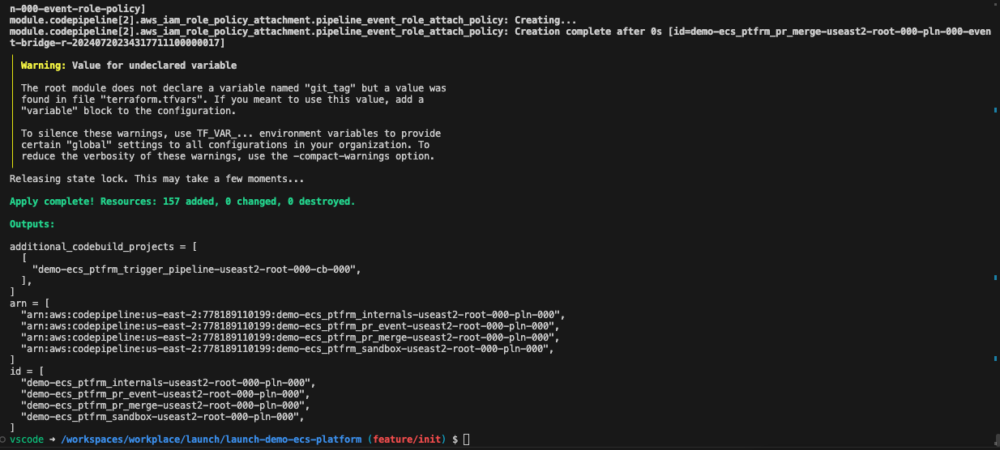
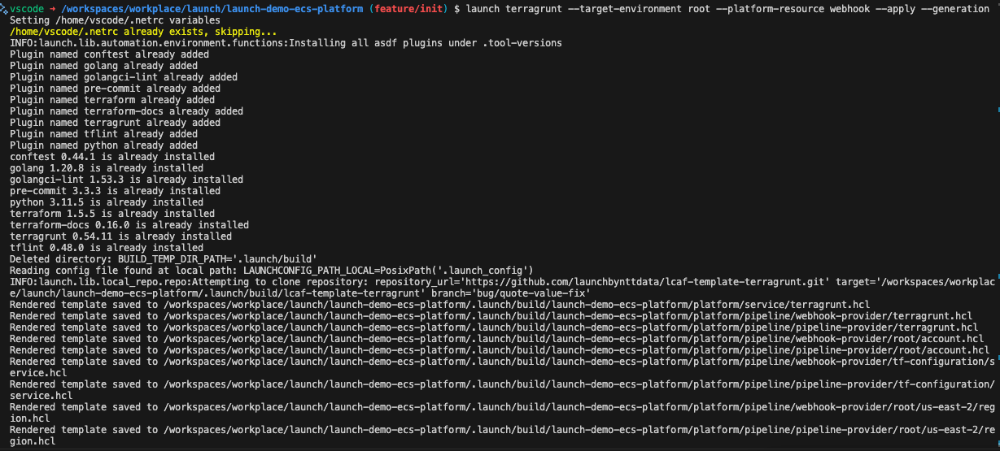
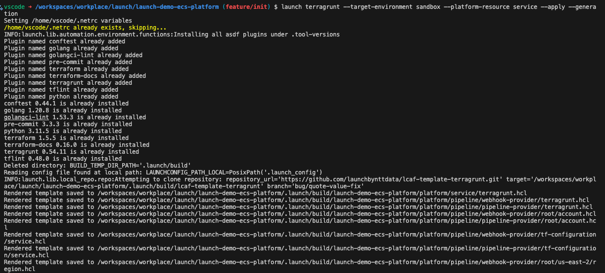
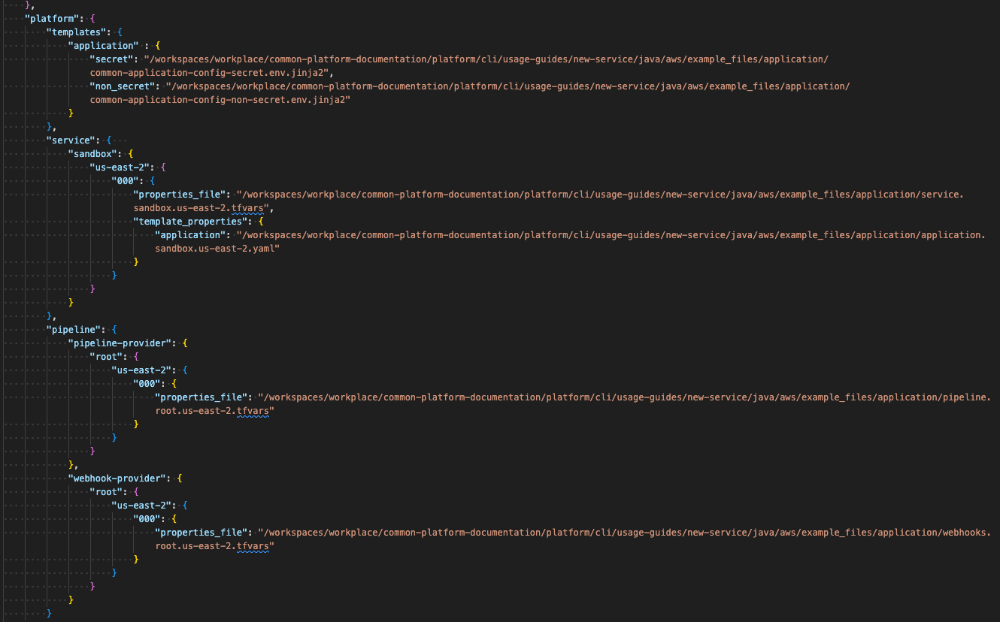

# Usage Guide: Create and deploy a new Java service [AWS] ( 1.5 hours )
## **Table of Contents**
1. [Introduction](#introduction)
2. [Basics](#basics)
3. [Deploy Infrastructure](#deploy-infrastructure)
4. [Deploy Java Application](#deploy-java-application)
5. [View the Java Application](#view-the-java-application)
5. [Maintenance](#maintenance)

## 1. **Introduction**
This guide will describe how to deploy a new java service using Launch's cli utility `launch-cli`. Within this guide, we will deploy necessary infrastructure to host a container application. Among the infrastructure, We need to deploy an ECR repository to store the new java containers being built. Secrets Manager to host your container's secrets. Finally, it will deploy an ECS cluster to support and serve the new java service. 

High level diagram of the architecture we are going to create in this guide.

<p align="center">
   
</p>


This guide has been modified to work with the following providers:

- Service provider: **AWS**
- Pipeline provider: **AWS**

External dependencies:
- [Java application built to Launch's requirements.](#)This guide will use the following repository: 
  - [https://github.com/launchbynttdata/launch-api-hex-java-template](https://github.com/launchbynttdata/launch-api-hex-java-template)

## 2. **Basics**

In order to use this guide, it is assumed your local development environment is set up to use the `launch-cli` platform. To log into your aws credentials, you can utilize the `aws sso utils`. Here is a list of complete guides to follow to set up your local development environment before this guide can be used successfully.

- [Setting up local environment - Mac](#)
  - or [Setting up local environment - Windows](#)
- [Setting up AWS config](./../../../../../development-environments/local/aws/config/README.md)
- [Setting up `aws-sso-utils`](./../../../../../development-environments/local/aws/sso-login/README.md)
- [Setting up Visual Studio Code](./../../../../../development-environments/local/vscode/README.md) (Optional)
- [Setting up Visual Studio Code dev containers](./../../../../../development-environments/local/vscode/dev-containers/README.md) (Optional)
- [Installing launch-cli](./../../../../README.md)
- [Configuring Github Personal Access Token](#)


## 3. **Deploy Infrastructure**

### 3.1 Deploy Secrets Manager 
In this section, we will be deploying the secrets needed for our platform and java application.

### 3.2 Deploy IAM roles 
In this section, we will be deploying the IAM roles needed for our platform and java application. 

### 3.3 Deploy ECR Repository
In this section, we will be deploying the necessary infrastructure to store our java image built. 

### 3.4 Deploy ECS Platform
In this section, we will be deploying the ECS platform that our application will be deployed onto. 

#### 3.4.1 Create the inputs for the ECS PLatform
This guide has provided basic inputs to be used with the services we are deploying. However, we cannot use these right out of the box and we need to quickly update some paths within our `.launch_config` file.

The launch config for the platform in this guide is at the following:
- [./example_files/platform/.launch_config](example_files/platform/.launch_config)

Open this file and update the `properties_file` key with the exact path from your system to the input files to be used, and then save it.

We are going to be using the following inputs for our `.launch_config` files. 
- [Service `properties file ./example_files/platform/service.sandbox.us-east-2.tfvars](./example_files/platform/service.sandbox.us-east-2.tfvars)
- [Pipeline `properties file` ./example_files/platform/pipeline.root.us-east-2.tfvars](./example_files/platform/pipeline.root.us-east-2.tfvars)
- [Webhooks `properties file` ./example_files/platform/webhooks.root.us-east-2.tfvars](./example_files/platform/webhooks.root.us-east-2.tfvars)

<p align="center">
   
</p>

#### 3.4.2 Create the ECS Platform service
Replace the path in the `--in-file` argument to the exact path of the `.launch_config` file saved in the previous section. 
```
~ $ launch service create --name launch-demo-ecs-platform --in-file /workspaces/workplace/common-platform-documentation/platform/cli/usage-guides/new-service/java/aws/example_files/platform/.launch_config
```
<p align="center">
   
</p>

#### 3.4.3 Generate the Terragrunt files for the ECS Platform service

Change into the directory of the newly created service. 

```
~ $ cd sample-demo-app
~ $ launch service generate
```
<p align="center">
   
</p>

<p align="center">
   
</p>

#### 3.4.4 Deploy the ECS Platform service

Deploy the pipeline for the service
```
~ $ launch terragrunt --target-environment root --platform-resource pipeline --apply --generation
```
<p align="center">
  <br>
  output truncated... <br>
  
</p>

Deploy the webhooks for the service

```
~ $ launch terragrunt --target-environment root --platform-resource webhooks --apply --generation
```
<p align="center">
  <br>
  output truncated... <br>
  
</p>

Deploy the service
```
~ $ launch terragrunt --target-environment sandbox --platform-resource service --apply --generation
```
<p align="center">
  <br>
  output truncated... <br>
  
</p>


#### 3.4.5 Connect the webhooks
Navigate to your organization's SCM, this guide will be using Github.

In Github, navigate to the newly created repository. Under `Settings`, navigate to `Webhooks` and click `Add webhook`.
<p align="center">
   
</p>


## 4. **Deploy Java Application**

#### 4.1.1 Create the inputs for the Java application

We are going to be using the following inputs for our `.launch_config` files. 
- [./example_files/application/service.sandbox.us-east-2.tfvars](example_files/application/service.sandbox.us-east-2.tfvars)
- [./example_files/application/pipeline.root.us-east-2.tfvars](example_files/application/pipeline.root.us-east-2.tfvars)
- [./example_files/application/webhooks.root.us-east-2.tfvars](example_files/application/webhooks.root.us-east-2.tfvars)

This guide has provided basic inputs to be used with the services we are deploying. However, we cannot use these right out of the box and we need to do some quick updated of paths within our `.launch_config` file.

The launch config for the application in this guide is at the following:
- [./example_files/application/.launch_config](example_files/application/.launch_config)

Open this file and update the `properties_file` key with the exact path from your system to the input files to be used and then save it.
<p align="center">
   
</p>

We are going to be using the following inputs for our `.launch_config` files. 
- [Service `properties file ./example_files/application/service.sandbox.us-east-2.tfvars](./example_files/application/service.sandbox.us-east-2.tfvars)
- [Pipeline `properties file` ./example_files/application/pipeline.root.us-east-2.tfvars](./example_files/application/pipeline.root.us-east-2.tfvars)
- [Webhooks `properties file` ./example_files/application/webhooks.root.us-east-2.tfvars](./example_files/application/webhooks.root.us-east-2.tfvars)

The launch config for the platform in this guide is at the following:
- [./example_files/application/.launch_config](example_files/application/.launch_config)

#### 4.1.2 Create the Java applciation service
Replace the path in the `--in-file` argument to the exact path of the `.launch_config` file saved in the previous section. 
```
~ $ launch service create --name launch-demo-ecs-application --in-file /workspaces/workplace/common-platform-documentation/platform/cli/usage-guides/new-service/java/aws/example_files/application/.launch_config
```
<p align="center">
   
</p>

#### 4.1.3 Build the image and push
```
~ $ cd launch-demo-ecs-application
~ $ launch service build --container-registry "020127659860.dkr.ecr.us-east-2.amazonaws.com" --container-image-name "launch-api" --container-image-version "0.0.1-dev" --push
```
<p align="center">
   <br>
   <br>
  output truncated... <br>
  
</p>

#### 4.1.4 Generate the Terragrunt files for the Java application service
Change into the directory of the newly created Java application service. 

```
~ $ launch service generate
```
<p align="center">
   
</p>

#### 4.1.5 Deploy the Java application service

Deploy the webhooks for the Java application service
```
~ $ launch terragrunt --target-environment root --platform-resource pipeline --apply --generation
```


Deploy the pipeline for the Java application  service
```
~ $ launch terragrunt --target-environment root --platform-resource webhooks --apply --generation
```


Deploy the Java application service
```
~ $ launch terragrunt --target-environment sandbox --platform-resource service --apply --generation
```


#### 4.1.6 Connect the webhooks
Within this section, we need to connect the webhooks for the newly created service and the Java application. Both of these repositories will utilize the same webhooks.

In this first section, we will connect the new created repository.
- Navigate to your organization's SCM, this guide will be using Github.
- In Github, navigate to the newly created repository. Under `Settings`, navigate to `Webhooks` and click `Add webhook`.
<p align="center">
   
</p>


We will now connect the webhooks for the Java application
- Navigate to your organization's SCM, this guide will be using Github.
- In Github, navigate to the Java application repository. Under `Settings`, navigate to `Webhooks` and click `Add webhook`.
<p align="center">
   
</p>


## 5. **View the Java Application**
