# Usage Guide: Set up OpenVPN Client to connect to AWS Client VPN Endpoint [AWS] (0.5 hours)
## **Table of Contents**
1. [Introduction](#1-introduction)
2. [Prerequisites](#2-Prerequisites)
3. [Downloading OpenVPN Connect Software](#3-downloading-openvpn-connect-software)
4. [macOS Instructions](#4-macos-instructions)
5. [Windows Instructions](#5-windows-instuctions)
6. [Configuring OpenVPN Connect](#6-configuring-openvpn-connect)
7. [Appendix](#7-appendix)

## 1. **Introduction**
This guide will describe how to establlish connectivity to the AWS VPN endpoint in the launch.nttdata.com root account in order to reach specific AWS resources in this and our other AWS accounts (e.g. sandbox, prod) using the AWS CLI, AWS Console, and OpenVPN Connect using mutual certificate-based authentication.

The AWS Client VPN Endpoint has been configured with split-tunneling enabled, minimizing data transfer to and from AWS to that which is essential to this (or future) services.

## 2. **Prerequisites**
- Follow the [Setting up AWS config guide](../../../../../../platform/development-environments/local/aws/config/README.md)
- Follow the [Setting up aws-sso-utils guide](../../../../../../platform/development-environments/local/aws/sso-login/README.md)
- AWS Console Access to the launch.nttdata.com root account

## 3. **Downloading OpenVPN Connect Software**
- In order to install the current version of the OpenVPN Connect client (version 3.4.9 as-of the time of this documentation), follow the steps below

1. In your web browser, visit https://openvpn.net/client/
2. The site will attempt to detect the OS you are currently using and open the appropriate section for that OS.
3. If it has opened a section for the incorrect target OS, click on the mid-page tab corresponding to your target OS

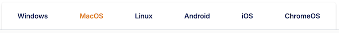

- Follow your OS-specific instructions below to complete your download:
  - [macOS](#4-macos-instructions)
  - [Windows](#5-windows-instuctions)

## 4. **macOS Instructions**
## 4.1 **Downloading OpenVPN Connect for Mac**
1. Click on the large button labeled "Download OpenVPN Connect for Mac" to download the software as a .dmg image
2. Once the download has been completed, locate the downloaded file in your Downloads, and click to open
3. Double-click the installer for your device, based upon the CPU type your target device uses. For users within Launch, this is typically the "Mac with Apple Silicon chip" installer

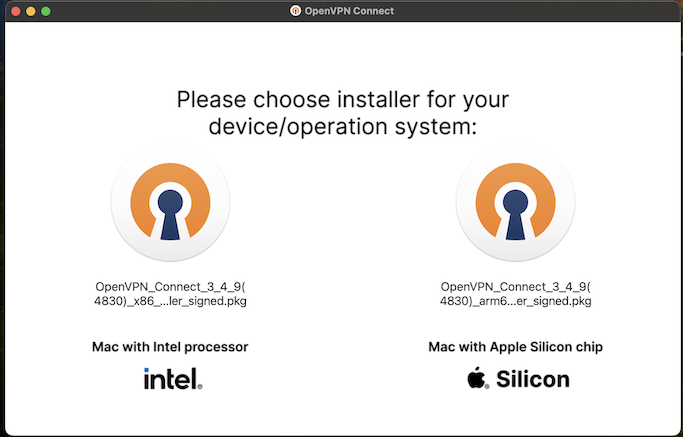

4. Proceed with the installer's installation steps.

## 4.2 **Obtaining Files For VPN Configuration**
- Open a **Terminal** via **Launchpad**
- (Optional) Open the **AWS Console** in your web browser
  - Log into the AWS Access Portal via [Okta](https://services-onentt.okta.com/app/UserHome)'s "AWS IAM Identity Center [2]" application tile
  - Click to expand the entry for launch.nttdata.com, then click on your desired role name (e.g. AdministratorAccess) to log into that account's AWS Console

### 4.2.1 **Downloading AWS Client VPN Configuration**

The configuration has been stored centrally within the Launch AWS Root account's AWS Secrets Manager at `arn:aws:secretsmanager:us-east-2:538234414982:secret:vpn/client_test/client_config`

It can most easily be retrieved via the AWS CLI, but is also available via the AWS Console (instructions available in the [Appendix](#72-retrieve-aws-client-vpn-configuration-via-aws-console)).

```sh
CLIENT_CONFIG=$(aws --profile launch-root-admin secretsmanager get-secret-value  \
--secret-id=arn:aws:secretsmanager:us-east-2:538234414982:secret:vpn/client_test/client_config \
--query SecretString | sed -e 's/^"//' -e 's/"$//');
printf "%b" $CLIENT_CONFIG  > ~/client_config.ovpn
```

### 4.2.2 **Downloading Client Certificate and Key .p12 Bundle**

The cert bundle has been stored centrally within the Launch AWS Root account's AWS Secrets Manager at `arn:aws:secretsmanager:us-east-2:538234414982:secret:vpn/client_test/cert_bundle`

Because this file is binary rather than text, it cannot be retreived via the AWS Console and requires use of the AWS CLI.  The command below will place it in your home directory with a .p12 file extension with appropriate file permissions.

```sh
aws --profile launch-root-admin secretsmanager get-secret-value \
--secret-id=arn:aws:secretsmanager:us-east-2:538234414982:secret:vpn/client_test/cert_bundle \
--query SecretBinary --output text | base64 --decode > ~/cert_bundle.p12 && chmod 0600 ~/cert_bundle.p12
```

### 4.2.3 **Obtaining .p12 Bundle password**

The password for the cert bundle has been stored centrally within the Launch AWS Root account's AWS Secrets Manager at `arn:aws:secretsmanager:us-east-2:538234414982:secret:vpn/client_test/passphrase`

It can most easily be retrieved via the AWS CLI, but is also available via the AWS Console (instructions available in the [Appendix](#73-retrieve-p12-bundle-password-via-aws-console)).


Execute the following in your shell to display the password for the encrypted .p12 bundle, select the value, and copy it to your clipboard for later use.

```sh
aws --profile launch-root-admin secretsmanager get-secret-value \
--secret-id=arn:aws:secretsmanager:us-east-2:538234414982:secret:vpn/client_test/passphrase \
--query SecretString --output text | cut -d: -f2 | sed -e 's/^"//' -e 's/"}$//'
```

## 5. **Windows Instuctions**
## 5.1 **Downloading OpenVPN Connect for Windows**
- Click on the large button labeled "Download OpenVPN Connect for Windows" to download the software as an .msi installer
- Once the download has been completed, double-click on the downloaded .msi installer file to begin installation.
- Proceed with the installer's installation steps.

## 5.2 Obtaining Files For VPN Configuration
- Open a **Command Prompt** from the **Start Menu**
- Open the **AWS Console** in your web browser
  - Log into the AWS Access Portal via [Okta](https://services-onentt.okta.com/app/UserHome)'s "AWS IAM Identity Center [2]" application tile
  - Click to expand the entry for launch.nttdata.com, then click on your desired role name (e.g. AdministratorAccess) to log into that account's AWS Console

### 5.2.1 **Downloading AWS Client VPN Configuration**
The configuration has been stored centrally within the Launch AWS Root account's AWS Secrets Manager at `arn:aws:secretsmanager:us-east-2:538234414982:secret:vpn/client_test/client_config`

- In the AWS Console for Launch's AWS Root account, navigate to "AWS Secrets Manager" > Secrets > vpn/client_test/client_config


- Click the button labeled "Retrieve Secret Value", click Plaintext, select all lines (currently 51) within the Secret value section of the page (from the first line of "client" through the last line ending with "name"), copy, then paste the value into the text editor of your choice, and save the file in the path of your choice, with a .ovpn file extension

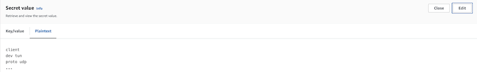

### 5.2.2 **Downloading Client Certificate and Key .p12 Bundle**
The cert bundle has been stored centrally within the Launch AWS Root account's AWS Secrets Manager at `arn:aws:secretsmanager:us-east-2:538234414982:secret:vpn/client_test/cert_bundle`

Because this file is binary rather than text, it cannot be retreived via the AWS Console and requires use of the AWS CLI

- Execute the following in your Command Prompt after having signed in via SSO and note that the file been saved to your user profile directory with a .p12 file extension with appropriate file permissions.

```bat
set CertBundle="%UserProfile%\cert_bundle.p12"
aws --profile launch-root-admin secretsmanager get-secret-value ^
--secret-id=arn:aws:secretsmanager:us-east-2:538234414982:secret:vpn/client_test/cert_bundle ^
--query SecretBinary --output text > cert_bundle.base64
certutil -decode cert_bundle.base64 %CertBundle%
del cert_bundle.base64
Icacls %CertBundle% /c /t /Inheritance:d
Icacls %CertBundle% /c /t /Grant %UserName%:F
TakeOwn /F %CertBundle%
Icacls %CertBundle% /c /t /Grant:r %UserName%:F
Icacls %CertBundle% /c /t /Remove:g "Authenticated Users" BUILTIN\Administrators BUILTIN Everyone System Users
set CertBundle=""
```

### 5.2.3. **Obtaining .p12 Bundle password**
The password for the encrypyed cert bundle has been stored centrally within the Launch AWS Root account's AWS Secrets Manager at `arn:aws:secretsmanager:us-east-2:538234414982:secret:vpn/client_test/passphrase`

It can most easily be retrieved via the AWS CLI, but is also available via the AWS Console (instructions available in the [Appendix](#73-retrieve-p12-bundle-password-via-aws-console)).

Execute the following in your shell after having signed in via SSO, select the value within the key/value pair displayed. and copy it to your clipboard for later use.

```bat
aws --profile launch-root-admin secretsmanager get-secret-value ^
--secret-id=arn:aws:secretsmanager:us-east-2:538234414982:secret:vpn/client_test/passphrase ^
--query SecretString --output text
```

## 6. **Configuring OpenVPN Connect**
## 6.1. **Adding Cert .p12 Bundle to OpenVPN Connect**
> [!IMPORTANT]
> When you first the OpenVPN Connect application, it is likely going to start with Import Profile; however, because a Certificate & Key must be available to assign to a profile before it can be saved, the profile configuration must be deferred until later.

In the upper-left of the application window, there is an expandable hamburger-style menu  you must first click.  Once expanded, you will see other application features.

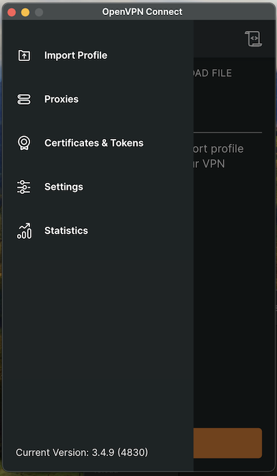

Click on "Certificates and Tokens", then the tab for "PKCS #12", then "Add Certificate" toward the bottom of the window
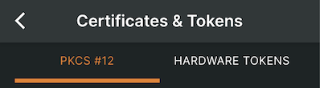


> [!IMPORTANT]
> Windows users only should navigate to their user profile directory, right click on the .p12 certificate and key bundle, and click **Install PFX**, then accept all default values in the configuration wizard for it to be correctly installed at the system level and ready for use with OpenVPN Connect.

Navigate to the path where you previously saved the .p12 certificate and key bundle, click the filename, then click "Open" and you will be prompted to enter the password from the prior section.

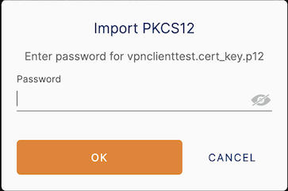

Enter the password, then click "OK" to continue.

> [!IMPORTANT]
> macOS users only should be prompted at this point for the password to their openvpn-associated keychain, in order for it to be successfully and securely saved at the system level.

If entered correctly, at this point, the "Certificates and Tokens" screen of OpenVPN Connect should display an entry for "vpnclienttest.launch.nttdata.com" with certificate and key icons to the left of the name.


Click the back arrow at the top of the window to return to the application menu.

## 6.2. **Adding Client Configuration Profile to OpenVPN Connect**

Select the OpenVPN Connect menu option for "Import Profile", then the tab labeled "Upload File"

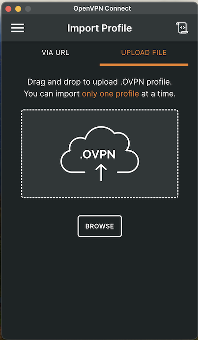

At this point you can either click the "Browse" button and select the .ovpn file which you downloaded earlier, or you can drag-and-drop the file into the target area above the button.

You should now see the label "Imported Profile" at the top of the window, with filled-in Profile Name and Server Names, but nothing assigned for "Certificate and Key"

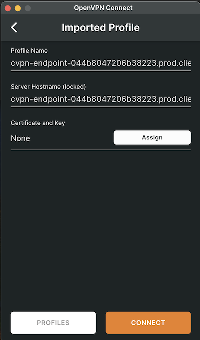

> [!NOTE]
> Do not click "Connect" at this point, as your profile lacks a Certificate and Key, so the connection attempt cannot succeed.

## 6.3 **Assign Certificate to Profile**
Click on the button labeled "Assign".  The application will return to "Certificates and Tokens" view, and you can now select your previously imported certificate bundle from the list under "PKCS #12".  After ensuring that the radio button for the correct certificate is selected, click "Confirm".

You should now see a completed profile such as the following:

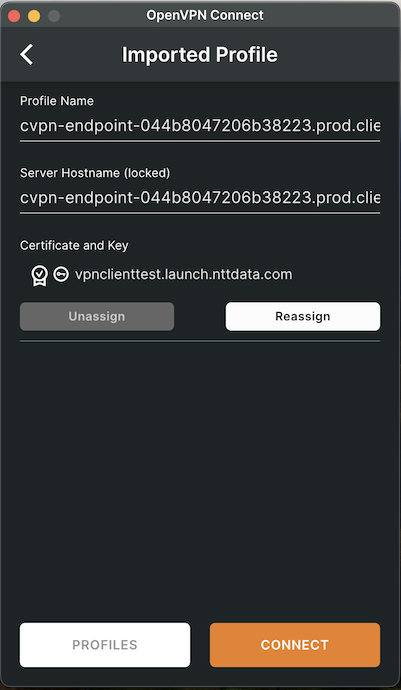

You may now click "Connect".  If successful, you will soon see a status of "Connected" along with "Connection Stats" showing your VPN traffic throughput.

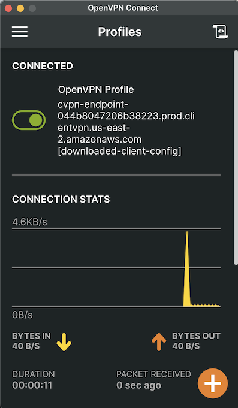

## 7. **Appendix**

## 7.1. **Toggle VPN Connection** 
When connected to the VPN, you can disconnect by clicking the slider toggle at the top of the window from the "On/Right/Green" position to toggle it to a disconnected state where it is "Off/Left/Gray"

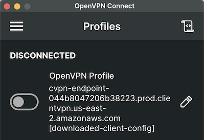

To reconnect, simply click the slider toggle again to return to a Connected state.

## 7.2 **Retrieve AWS Client VPN Configuration via AWS Console**
- In the AWS Console for Launch's AWS Root account, navigate to "AWS Secrets Manager" > Secrets > vpn/client_test/client_config


- Click the button labeled "Retrieve Secret Value", click Plaintext, select all lines (currently 51) within the Secret value section of the page (from the first line of "client" through the last line ending with "name"), copy, then paste the value into the text editor of your choice, and save the file in the path of your choice, with a .ovpn file extension


## 7.3 **Retrieve .p12 Bundle password via AWS Console**
- In the AWS Console for Launch's AWS Root account, navigate to "AWS Secrets Manager" > Secrets > vpn/client_test/passphrase]


- Click the button labeled "Retrieve Secret Value", click Key/value, then click the copy icon next to value in the Secret value column in order to get the cert bundle's password into your clipboard.

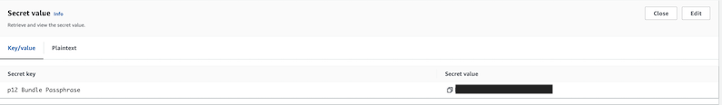

## 7.4 **AWS VPN Client application**
While it is also possible to connect to the AWS Client VPN Endpoint using the AWS VPN Client application, the official documentation requires an unencrypted private key to be manually added to the client configuration file, which is unsecure when using mutual certificate-based authentication.

In the future, SSO SAML-based authentication is the desired end state, which will require corporate IT integrations with Okta for SAML endpoints and will likely require additional DNS configuration within our AWS accounts.  When this does occur, it should be possible to distribute a single file for configuration with without compromising security.
