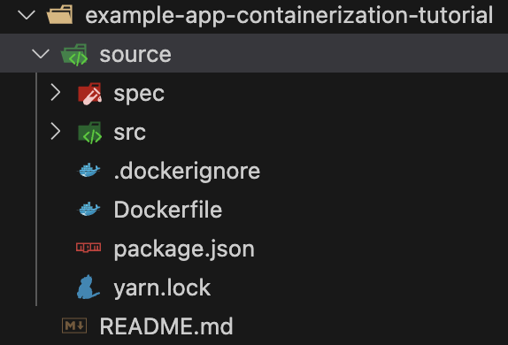

# Exclusive Service
## **Table of Contents**
1. [Introduction](#1-introduction)
2. [Prerequisites](#2-prerequisites)  
3. [Launchify your Application](#3-launchify-your-application)  
  3.1. [Directory Structure](#31-directory-structure)  
  3.2. [Required files](#32-required-files)  
4. [Launchify Tutorial](#4-launchify-tutorial)  
  4.1. [Base Project](#41-base-project)  
  4.2. [Containerize Project](#42-containerize-project)  
  4.3. [Launch-ify project](#43-launch-ify-project)  
  4.4. [Deploy Project](#44-deploy-project)  
5. [References](#5-references)  

## 1. Introduction
An exclusive service in the Launch `common-automation-framework` (LCAF) platform is a service that utilizes many additional services, called shared services. An exclusive service is not dependant on any other service to run and operate nominal. This guide will walk you through on how to turn your application into a repository that can be utilized by the Launch CAF platform. 

## 2. Prerequisites
In order to use this framework successfully, there may be assumptions within your current environment. Please follow these other guides that are dependencies to successfully utilizes the `common-automation-framework`.

Local development environment:
- [MacOS local developer environment](./../development-environments/local/mac/README.md)
- [Windows local developer environment](./../development-environments/local/windows/README.md)

Developer Containers:
- [Jetbrains IDEs](./../development-environments/local/tools/jetbrains/dev-containers/README.md)
- [Visual Studio Code](./../development-environments/local/tools/vscode/dev-containers/README.md)

## 3. Launchify your Application
In order for an application to be used with the Launch platform, there are assumptions about your repository.

The following is a high level view of how your repository organization should look after adding all the directories and files in this section.  

```sh
source/ # Folder containing your application code. 
platform/ # Folder for the Launch CAF Platform
test/ # Folder for the Launch Test Platform 
.gitignore # git ignore file
.lcafenv # LCAF environment variables. Used to override Makefile variables
.secrets.baseline # Credential code scanning
.tool-versions # asdf/mise packages
Makefile # Makefile used for the common-automation-framework
Makefile.includes # Makefile variables to include
```

### 3.1. Directory Structure
Within your repository, you should structure your application with the following recommend directories. There are 3 basic folders, the `source`, `platform`, and `test` folder.

#### 3.1.1 `source` folder
This folder is where your application code lives. If your application is a container, your Dockerfile should live here. `make build` assumes your application lives in this folder. 

> Can be overridden with `SOURCE_FOLDER` Makefile variable. 

#### 3.1.2 `platform` folder
This folder is where your infrastructure platform will live. This will contain any pipeline or webhook resources for your CICD. 

This folder can and should be automatically generated from the `launch service <create|update>` command

#### 3.1.3 `test` folder
This folder is where your test infrastructure will live.

> TODO: Not Implemented. 

### 3.2. Required files

To Launch-ify an application, these files need to be added to you repository. Please copy these files and replace or add the necessary configuration for your application. 

- [.secrets.baseline](#321-secretsbaseline)
- [.tool-versions](#322-tool-versions)
- [Makefile](#323-makefile)
- [.lcafenv](#324-lcafenv)
- [Makefile.includes](#325-makefileincludes)
- [.gitignore](#326-gitignore)

#### 3.2.1. .secrets.baseline
This file is used as part of the credential detect-secrets workflow. You can copy this file as is without any changes.
- [.secrets.baseline](https://github.com/launchbynttdata/lcaf-template-terragrunt/blob/main/.secrets.baseline)


#### 3.2.2. .tool-versions
This file is used to specify any package dependencies you may have to build or run your application. The packages shown here are the minimum packages needed for the Launch Platform and will be required in your `.tool-versions` file. 
- [.tool-versions](https://github.com/launchbynttdata/lcaf-template-terragrunt/blob/main/.tool-versions)

Example of file:
```sh
pre-commit 3.3.3
python 3.11.5
repo-tool v2.10.3-launch # https://github.com/launchbynttdata/asdf-repo-tool
java corretto-17.0.12.7.1
conftest 0.44.1
golang 1.21.7
golangci-lint 1.55.2
regula 3.2.1 # https://github.com/launchbynttdata/asdf-regula
terraform 1.5.5
terraform-docs 0.16.0
terragrunt 0.54.11
tflint 0.48.0
```

#### 3.2.3. Makefile
This file is used for the `make` system within the LCAF platform. You can copy the file as is to your application repository with no changes. 
- [Makefile](https://github.com/launchbynttdata/lcaf-template-terragrunt/blob/main/Makefile)


#### 3.2.4. .lcafenv
This file is used for the LCAF platform environmental variables.
- [`.lcafenv`](https://github.com/launchbynttdata/lcaf-template-terragrunt/blob/main/.lcafenv)

Please refer to LCAF documentation for a full breakdown of each environmental variable. The most likeky variables you should be setting are:
- `REPO_MANIFEST`: Manifest used by your application. This will typically be related to the builder tools you are using to build your application. 
- `REPO_BRANCH`: Branch of the manifest used. 

Example of file:
```sh
# Use this file to preset variables used by the Makefile.
# This file will be included when make is run. The variables below, will
# take precedence over what is defined in Makefile when they are set. This
# allows overriding certain settings without modifying the Makefile.

# REPO_MANIFESTS_URL="https://github.com/nexient-llc/launch-common-automation-framework.git"
REPO_BRANCH="main"
REPO_MANIFEST="manifests/terraform_modules/seed/manifest.xml"
# REPO_URL="https://github.com/nexient-llc/git-repo.git"
# REPO_REV="main"
# GITBASE="https://github.com/nexient-llc/"
# GITREV="main"
# IS_PIPELINE="false"
# IS_AUTHENTICATED="false"
# JOB_NAME="job"
# JOB_EMAIL="job@job.job"s
# PLATFORM_VER=
# CONTAINER_VER=
# PIPELINES_VER=
# WEBHOOK_VER=
# PYTHON_VER=
# TERRAGRUNT_VER=
# TERRAFORM_VER=
```

#### 3.2.5. Makefile.includes
This file containers the variables need
- Makefile.includes

Example of file:
```sh
# Container-specific variables:
CONTAINER_REGISTRY ?= my.container.registry.com
CONTAINER_IMAGE_NAME ?= launch-api
CONTAINER_IMAGE_VERSION ?= s1
BUILD_ARGS ?= --progress plain --no-cache
DOCKER_BUILD_ARCH ?= linux/amd64
```

#### 3.2.6. .gitignore
This file contains the .gitignore you will need to prevent unneeded LCAF build files to be committed to your repository. 
- [.gitignore](https://github.com/launchbynttdata/lcaf-template-terragrunt/blob/main/.gitignore)

## 4. Launchify Tutorial
In this section, we will walk through Launch-ify an application. We will containerize an application and then adding the necessary files to successfully work with the Launch Platform. 

### 4.1 Base Project
We will be using the following example project during this tutorial

- [example-app-containerization-tutorial](https://github.com/launchbynttdata/example-app-containerization-tutorial)

```sh
git clone https://github.com/launchbynttdata/example-app-containerization-tutorial.git
```

### 4.2 Containerize Project
We will now add a `Dockerfile` to the project for containerization.

```sh
# Ensure you are in the cloned repo's directory
cd example-app-containerization-tutorial
echo 'FROM node:18-alpine
WORKDIR /app
COPY . .
RUN yarn install --production
CMD ["node", "src/index.js"]
EXPOSE 3000' > Dockerfile
```

The example application has now been containerized. 

### 4.3 Launch-ify project
We will now make the necessary changes to the project to launch-ify it.

#### 4.3.1 Folder Structure
Create a new folder at the root of the repository called `source`.

```sh
mkdir source
```

We will move all the files within this project except for the README into this folder. You can do this manually or use this quick one-line script.

```sh
find . -mindepth 1 -maxdepth 1 ! -name 'README.md' ! -name 'source' -exec mv "{}" source/ \;
```

You should now have a folder similar to the following:

<p align="center">
   
</p>

#### 4.3.2 Add required files
We now need to add the required files to the root of the project for the Launch platform.

```sh
wget https://github.com/launchbynttdata/lcaf-template-terragrunt/blob/main/.secrets.baseline
wget https://github.com/launchbynttdata/lcaf-template-terragrunt/blob/main/.tool-versions
wget https://github.com/launchbynttdata/lcaf-template-terragrunt/blob/main/Makefile
wget https://github.com/launchbynttdata/lcaf-template-terragrunt/blob/main/.gitignore
```

Create your `Makefile.includes` file based off the guidance in section [3.2.5](#325-makefileincludes)
```sh
# You can replace these vars to your needs. These defaults will work as well.
echo 'CONTAINER_REGISTRY ?= my.container.registry.com
CONTAINER_IMAGE_NAME ?= launch-example-tutorial
CONTAINER_IMAGE_VERSION ?= dev
BUILD_ARGS ?= --progress plain --no-cache
DOCKER_BUILD_ARCH ?= linux/amd64' > Makefile.includes
```

Update the `.lcafenv` file based off the guidance in [3.2.4](#324-lcafenv)
```sh
wget https://github.com/launchbynttdata/lcaf-template-terragrunt/blob/main/.lcafenv
vi .lcafenv
```

### 4.4 Deploy Project

## 5. References
- [Compatibility Matrix](./../README.md)
- [MacOS local developer environment](./../development-environments/local/mac/README.md)
- [Windows local developer environment](./../development-environments/local/windows/README.md)
- [Jetbrains IDEs](./../development-environments/local/tools/jetbrains/dev-containers/README.md)
- [Visual Studio Code](./../development-environments/local/tools/vscode/dev-containers/README.md)