# Exclusive-service: Java application on Elastic Container Service (ECS)
### **Table of Contents**
1. [Introduction](#1-introduction)
2. [Prerequisites](#2-Prerequisites)
3. [Getting Started](#3-getting-started)  
  3.1. [Create the repository](#31-create-the-repository)  
  3.2. [Configure the inputs](#32-configure-the-inputs)  
4. [Deploy Service](#4-deploy-service)  
  4.1. [Deploy Infrastructure](#41-deploy-infrastructure)  
  4.2. [Connect Webhooks](#42-connect-webhooks)  
  4.3. [Deploy Service](#43-deploy-service)  
5. [View the Java Application](#5-view-the-java-application)
6. [Teardown Service](#6-teardown-service)
7. [Appendix](#7-appendix)

## 1. **Introduction**
This guide will describe how to deploy a new java service using Launch's cli utility `launch-cli`. Within this guide, we will deploy necessary infrastructure to host a container application. Among the infrastructure, we will deploy an ECR repository to store the new java containers being built. Secrets Manager to host your container's secrets with a new customer managed KMS key. Finally, it will deploy an ECS cluster to support and serve the new java service. 

High level diagram of the architecture we are going to create in this guide.

<p align="center">
  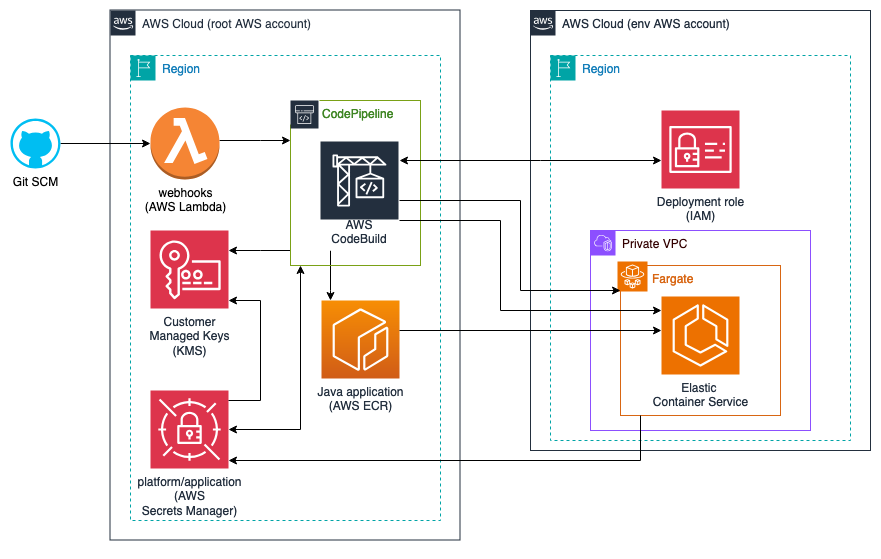 
</p>

## 2. **Prerequisites:**

In order to use this guide successfully, there may be assumptions within your current environment. Please follow these other guides that are dependencies to successfully utilizes this one. 

Local development environment:
- [MacOS local developer environment](./../../../../../development-environments/local/mac/README.md)
- [Windows local developer environment](./../../../../../development-environments/local/java/windows/README.md)

Java application built to [Launch's requirements.](#TODO)(TODO:)
- This guide will use the following repository: [launch-api-hex-java-template](https://github.com/launchbynttdata/launch-api-hex-java-template)

Cloud Services:
- [Elastic Container Service (ECS)](./../../../../shared-services/aws/ecs/README.md)
- [Identity and Access Management (IAM)](./../../../../shared-services/aws/iam//README.md)
- [Key Management Services (KMS)](./../../../../shared-services/aws/kms/README.md)
- [Secrets Manager](./../../../../shared-services/aws/secretsmanager/README.md)

## 3. **Getting Started**
#### Pre-flight
1. Please ensure you have set your AWS credentials.
    - If using SSO: [AWS SSO](./../../../../../development-environments/local/tools/aws/sso-login/README.md)
    - Standard config: [AWS cli](./../../../../../development-environments/local/tools/aws/cli/README.md)

2. Please ensure you have generated a Github token and it is ready to use in your environment.
    - [Github Token](./../../../../../development-environments/local/tools/token/README.md)
    ```sh
    export GITHUB_TOKEN=<replace_me>
    ```

3. (Optional) Configure a git credential manager to cache credentials
    - [git-credential-manager](./../../../../../development-environments/local/tools/git/git-credential-manager/README.md)

### 3.1. Configure the inputs
This guide has provided basic inputs to be used with the services we are deploying. However, we cannot use these right out of the box and we need to update some of the properties specific to your infrastructure. 

#### 3.1.1 Pipeline Properties
We are now going to update our pipeline properties with account spcific properties needed. We will be utilizing the pipeline file at the following location.
- [Pipeline `properties file` ./inputs/pipeline.root.us-east-2.tfvars](./inputs/pipeline.root.us-east-2.tfvars)

Update the following variables with spicific account information. Within each `sed` command, ensure you have the correct path to the pipeline properties file.  You can then run the entire block in the terminal to update the pipeline file.
```sh
# Update these variables
GITHUB_APPLICATION_ID='000000'
GITHUB_INSTALLATION_ID='00000000'
GITHUB_SIGNING_CERT_SECRET_NAME='github/app/aws-codepipeline-authentication/private_key'
ROOT_ACCOUNT_DEPLOY_ROLE='arn:aws:iam::111111111111:role/demo_iam-useast2-sandbox-000-role-000'
QA_ACCOUNT_DEPLOY_ROLE='arn:aws:iam::222222222222:role/demo_iam-useast2-sandbox-000-role-000'
UAT_ACCOUNT_DEPLOY_ROLE='arn:aws:iam::333333333333:role/demo_iam-useast2-sandbox-000-role-000'
PROD_ACCOUNT_DEPLOY_ROLE='arn:aws:iam::444444444444:role/demo_iam-useast2-sandbox-000-role-000'
CONTAINER_REGISTRY='020127659860.dkr.ecr.us-east-2.amazonaws.com'
CONTAINER_IMAGE_NAME='launch-api'

sed -i "s|<GITHUB_APPLICATION_ID>|$GITHUB_APPLICATION_ID|g" ./pipeline.root.us-east-2.tfvars
sed -i "s|<GITHUB_INSTALLATION_ID>|$GITHUB_INSTALLATION_ID|g" ./pipeline.root.us-east-2.tfvars
sed -i "s|<GITHUB_SIGNING_CERT_SECRET_NAME>|"$GITHUB_SIGNING_CERT_SECRET_NAME"|g" ./pipeline.root.us-east-2.tfvars
sed -i "s|<ROOT_ACCOUNT_DEPLOY_ROLE>|$ROOT_ACCOUNT_DEPLOY_ROLE|g" ./pipeline.root.us-east-2.tfvars
sed -i "s|<QA_ACCOUNT_DEPLOY_ROLE>|$QA_ACCOUNT_DEPLOY_ROLE|g" ./pipeline.root.us-east-2.tfvars
sed -i "s|<UAT_ACCOUNT_DEPLOY_ROLE>|$UAT_ACCOUNT_DEPLOY_ROLE|g" ./pipeline.root.us-east-2.tfvars
sed -i "s|<PROD_ACCOUNT_DEPLOY_ROLE>|$PROD_ACCOUNT_DEPLOY_ROLE|g" ./pipeline.root.us-east-2.tfvars
sed -i "s|<CONTAINER_REGISTRY>|$CONTAINER_REGISTRY|g" ./pipeline.root.us-east-2.tfvars
sed -i "s|<CONTAINER_IMAGE_NAME>|$CONTAINER_IMAGE_NAME|g" ./pipeline.root.us-east-2.tfvars
```

#### 3.1.2 Webhook Properties
We are now going to update our pipeline properties with account spcific properties needed. We will be utilizing the pipeline file at the following location.
- [Webhooks `properties file` ./inputs/webhooks.root.us-east-2.tfvars](./inputs/webhooks.root.us-east-2.tfvars)

```sh
# Update these variables
GIT_SECRET_SM_ARN='arn:aws:secretsmanager:us-east-2:111111111111:secret:example/git/signature/secret'

sed -i "s|<GIT_SECRET_SM_ARN>|$GIT_SECRET_SM_ARN|g" ./webhooks.root.us-east-2.tfvars
```

#### 3.1.3 Service Properties
- [Service QA `properties file` ./inputs/service.qa.us-east-2.tfvars](./inputs/service.qa.us-east-2.tfvars)
```sh
# service.qa.us-east-2.tfvars
ecs_cluster_arn_qa="arn:aws:ecs:us-east-2:020127659860:cluster/demo-ecs_ptfrm-useast2-qa-000-fargate-000"
private_subnets_qa=[\"subnet-11111111111111111\",\"subnet-22222222222222222\",\"subnet-33333333333333333\"]
vpc_id_qa="vpc-11111111111111111"

sed -i "s|<ecs_cluster_arn>|$ecs_cluster_arn_qa|g" ./service.qa.us-east-2.tfvars
sed -i "s|<private_subnets>|$private_subnets_qa|g" ./service.qa.us-east-2.tfvars
sed -i "s|<vpc_id>|$vpc_id_qa|g" ./service.qa.us-east-2.tfvars
```
- [Service UAT `properties file` ./inputs/service.uat.us-east-2.tfvars](./inputs/service.uat.us-east-2.tfvars)
```sh
# service.uat.us-east-2.tfvars
ecs_cluster_arn_uat="arn:aws:ecs:us-east-2:111111111111:cluster/demo-ecs_ptfrm-useast2-uat-000-fargate-000"
private_subnets_uat=[\"subnet-11111111111111111\",\"subnet-22222222222222222\",\"subnet-33333333333333333\"]
vpc_id_uat="vpc-11111111111111111"

sed -i "s|<ecs_cluster_arn>|$ecs_cluster_arn_uat|g" ./service.uat.us-east-2.tfvars
sed -i "s|<private_subnets>|$private_subnets_uat|g" ./service.uat.us-east-2.tfvars
sed -i "s|<vpc_id>|$vpc_id_uat|g" ./service.uat.us-east-2.tfvars
```
- [Service Prod `properties file` ./inputs/service.prod.us-east-2.tfvars](./inputs/service.prod.us-east-2.tfvars)
```sh
# service.prod.us-east-2.tfvars
ecs_cluster_arn_prod="arn:aws:ecs:us-east-2:111111111111:cluster/demo-ecs_ptfrm-useast2-prod-000-fargate-000"
private_subnets_prod=[\"subnet-11111111111111111\",\"subnet-22222222222222222\",\"subnet-33333333333333333\"]
vpc_id_prod="vpc-11111111111111111"

sed -i "s|<ecs_cluster_arn>|$ecs_cluster_arn_prod|g" ./service.prod.us-east-2.tfvars
sed -i "s|<private_subnets>|$private_subnets_prod|g" ./service.prod.us-east-2.tfvars
sed -i "s|<vpc_id>|$vpc_id_prod|g" ./service.prod.us-east-2.tfvars
```
- [Application `properties file` ./inputs/application.sandbox.us-east-2.yaml](./inputs/application.sandbox.us-east-2.yaml)
```sh
# application.sandbox.us-east-2.yaml
url="jdbc:postgresql://myDB-db.111111111111.us-east-2.rds.amazonaws.com:5432/postgres"
username="example/postgres/username"
password="example/postgres/password"
actuator_username="example/actuator/username"
actuator_password="example/actuator/password"

sed -i "s|<url>|$url|g" ./application.sandbox.us-east-2.yaml
sed -i "s|<username>|$username|g" ./application.sandbox.us-east-2.yaml
sed -i "s|<password>|$password|g" ./application.sandbox.us-east-2.yaml
sed -i "s|<actuator_username>|$actuator_username|g" ./application.sandbox.us-east-2.yaml
sed -i "s|<actuator_password>|$actuator_password|g" ./application.sandbox.us-east-2.yaml
```

#### 3.1.4 .launch_config
The launch config for the application in this guide is at the following:
- [./inputs/.launch_config](inputs/.launch_config)

Open this file and update the `properties_file` key with the absolute path from your system to the input files to be used, and then save it.

This application also includes 2 other files for jinja templates. Update these paths as well.
- [Application secrets templates./inputs/common-application-config-secret.env.jinja2](./inputs/common-application-config-secret.env.jinja2)
- [Application non-secrets templates ./inputs/common-application-config-non-secret.env.jinja2](./inputs/common-application-config-non-secret.env.jinja2)

Open this file and update the `properties_file` key with the absolute path from your system to the input files to be used and then save it.

<p align="center">
  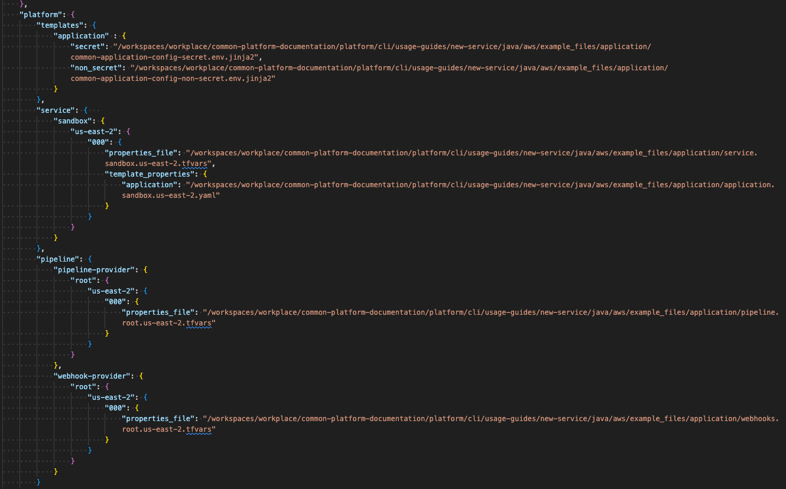 
</p>

### 3.2. Create the repository

We are now going to create the Java application properties repository.

Ensure you change back into your working directory `cd ..` , as you do not want to accidentally create another repository inside the previously created platform repository. 

- Replace the path in the `--in-file` argument to the absolute path of the `.launch_config` file saved in the previous section. 
- We are going to use the `--name` of `launch-demo-ecs-application` in this demo, but you can name it whatever you want.

```sh
launch service create --name launch-demo-ecs-application --in-file /workspaces/workplace/common-platform-documentation/platform/common-automation-framework/exclusive-services/java/aws/ecs/inputs/.launch_config
```

<p align="center">
  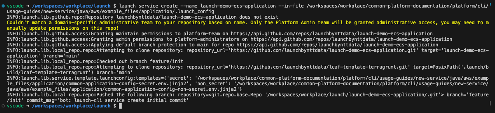 
</p>

## 4. **Deploy service**
### 4.1. Deploy Infrastructure
Deploy the pipeline for the Java application service. This step will deploy all the CICD pipeline infrastructure to manage this repository.

```sh
cd launch-demo-ecs-application # Ensure you are in the newly created repository's directory
launch terragrunt --target-environment root --platform-resource pipeline --apply --generation
```

<p align="center">
  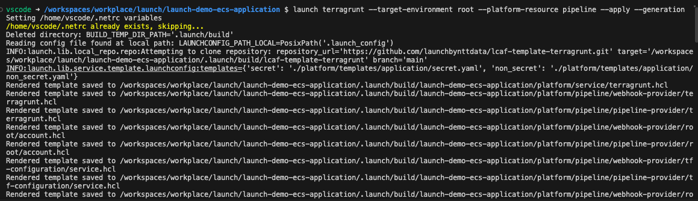<br>
  output truncated... <br>
  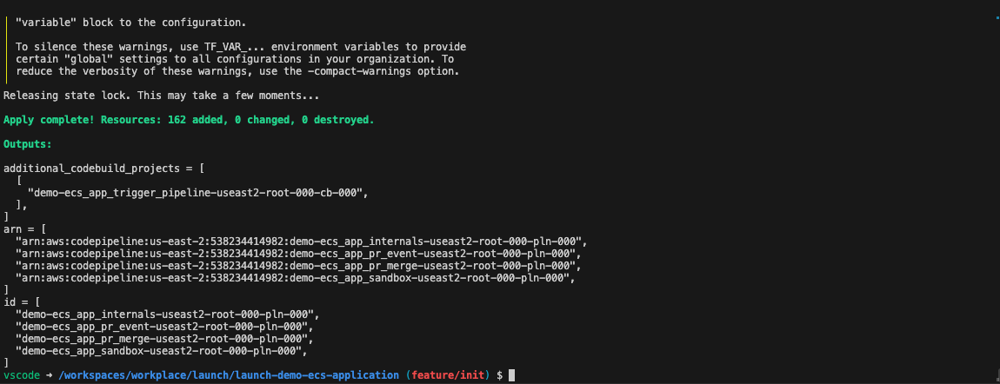
</p>

Deploy the webhooks for the Java application service. This will deploy lambda functions that we can connect to a SCM for pull request building events and triggering deployment pipelines. 

```sh
launch terragrunt --target-environment root --platform-resource webhook --apply --generation
```

<p align="center">
  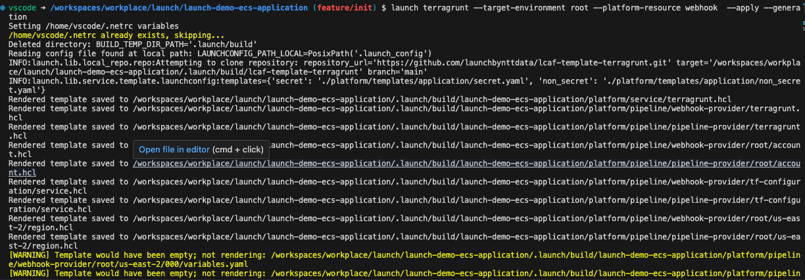<br>
  output truncated... <br>
  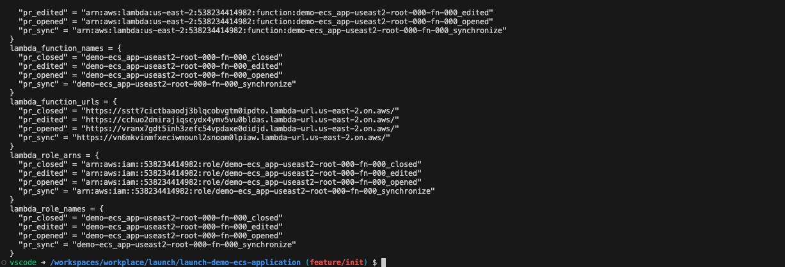
</p>


### 4.2. Connect Webhooks
In this section, we will connect the webhooks we deployed to lambda to github. 

In the previous section when deploying the webhooks, there were outputs of the lambda function urls that will be needed for use in this section. 

```
lambda_function_urls = {
  "pr_closed" = "https://p2jk22u7zdx7pzsymyilsgutkq0mydcm.lambda-url.us-east-2.on.aws/"
  "pr_edited" = "https://z2eblvqlfag47jczuxp4ftchja0htekd.lambda-url.us-east-2.on.aws/"
  "pr_opened" = "https://nxnzebxlyzjqezihicogxgdp3m0mpeqy.lambda-url.us-east-2.on.aws/"
  "pr_sync" = "https://lmlhuj3xjog27jr7lb7diokhc40utzbu.lambda-url.us-east-2.on.aws/"
}
```

Alternatively, you can find the function URL by navigating to the lambdas in the AWS console.

<p align="center">
  <br>
  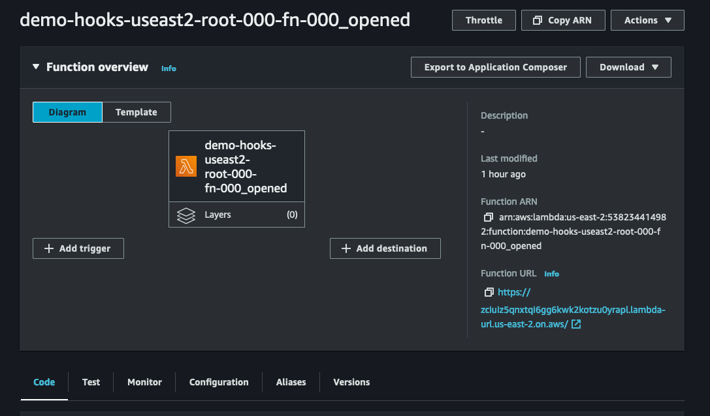
</p>


Using `launch-cli`, you will need to run this for each of the 4 lambda's functional url's.

> [WARNING]: You can not copy and paste this command directly. You need to update `MY_SECRET` with the value of the git secret created in the Secrets Manager section and the FUNCTION_URL for the lambda function url. 

```sh
launch github hooks create --repository-name launch-demo-ecs-application --events '["pull_request"]'  --secret MY_SECRET --url FUNCTION_URL_1
launch github hooks create --repository-name launch-demo-ecs-application --events '["pull_request"]'  --secret MY_SECRET --url FUNCTION_URL_2
launch github hooks create --repository-name launch-demo-ecs-application --events '["pull_request"]'  --secret MY_SECRET --url FUNCTION_URL_3
launch github hooks create --repository-name launch-demo-ecs-application --events '["pull_request"]'  --secret MY_SECRET --url FUNCTION_URL_4
```

<p align="center">
  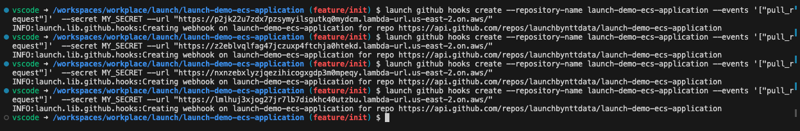
</p>

You will also need to connect the webhooks to the repository where your Java application lives. In this case, [launch-api-hex-java-template](https://github.com/launchbynttdata/launch-api-hex-java-template). You will use the same function urls.

```sh
launch github hooks create --repository-name launch-api-hex-java-template --events '["pull_request"]'  --secret MY_SECRET --url FUNCTION_URL_1
launch github hooks create --repository-name launch-api-hex-java-template --events '["pull_request"]'  --secret MY_SECRET --url FUNCTION_URL_2
launch github hooks create --repository-name launch-api-hex-java-template --events '["pull_request"]'  --secret MY_SECRET --url FUNCTION_URL_3
launch github hooks create --repository-name launch-api-hex-java-template --events '["pull_request"]'  --secret MY_SECRET --url FUNCTION_URL_4
```

<p align="center">
  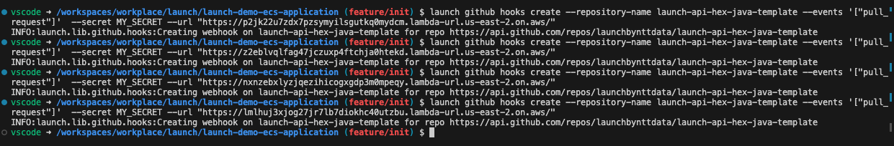
</p>

The webhooks will initially fail as the lambda does not allow ping requests.

<p align="center">
  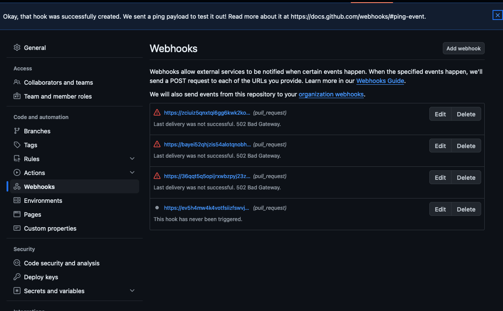
</p>

### 4.3. Deploy Service


#### 4.3.1 Open and merge your first pull request (PR)


#### 4.3.2 Manually deploy service
If you cannot wait for the pipeline to deploy your service through the PR process, you can manually deploy your service.

We will now deploy the Java application service. 

```sh
launch terragrunt --target-environment qa --platform-resource service --apply --generation --render-app-vars
```

<p align="center">
  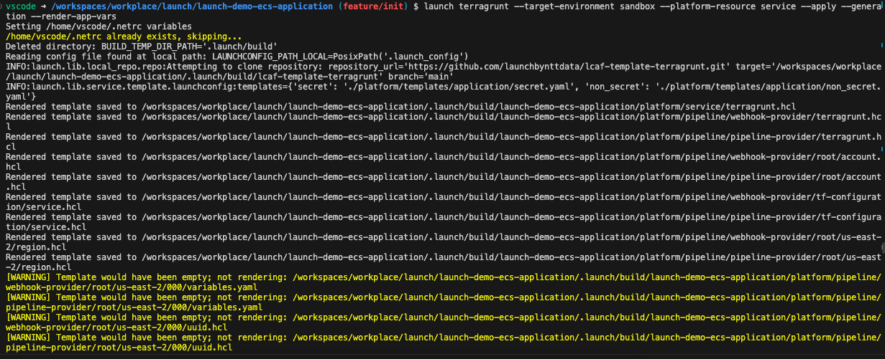<br>
  output truncated... <br>
  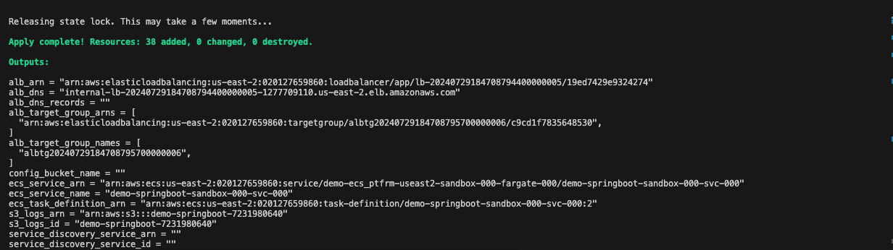
</p>

## 5. **View the Java Application**

[WARNING!!!]
```
This guide is not complete. You will need to manually update the following while updating on the additional development of the outstanding terraform modules.

- Update Secrets in root account with ecs task execution role
- Update KMS in root account with ecs task execution role
- Update ECR in root account with ecs task execution role
- create 8080 listener on `vpn-poc-nlb1` to `vpn-poc-nlb-albtg-privatelink2` target group
- attach ECS LB to the `vpn-poc-nlb-albtg-privatelink2` TG. 
```

In order to view the Java application, you will need a way to access the private VPC. 

Perform these guides to deploy an AWS Client VPN utilizing the launch platform to view this application in a private VPC:
- [Deploy Client VPN](#TODO)
- [Configure VPN Client](#TODO)

Utilize a bastion host:
- [AWS Bastion EC2 Host](#TODO)

Once you are able to connect to the private VPC that your application is running in:
 - You should see your application running by navigating to [http://vpn-poc-nlb1-84d114247ebc21eb.elb.us-east-2.amazonaws.com:8080/swagger-ui/index.html](http://vpn-poc-nlb1-84d114247ebc21eb.elb.us-east-2.amazonaws.com:8080/swagger-ui/index.html). 

<p align="center">
  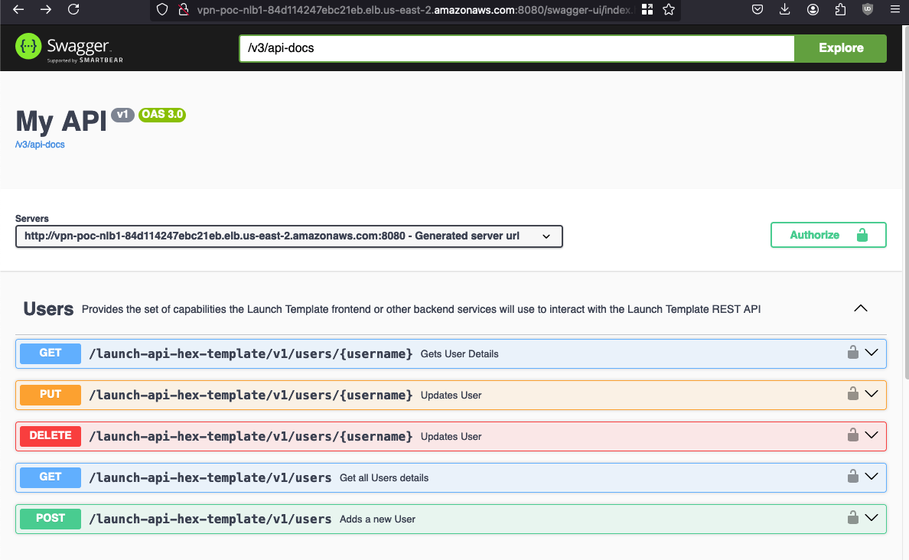<br>
</p>

## 6. **Teardown Service**
```sh
launch terragrunt --target-environment root --platform-resource pipeline --destroy --generation
launch terragrunt --target-environment root --platform-resource webhook --destroy --generation

# For each environment deployed
launch terragrunt --target-environment sandbox --platform-resource service --destroy --generation --render-app-vars
launch terragrunt --target-environment qa --platform-resource service --destroy --generation --render-app-vars
launch terragrunt --target-environment uat --platform-resource service --destroy --generation --render-app-vars
launch terragrunt --target-environment prod --platform-resource service --destroy --generation --render-app-vars
```

## 7. **Appendix**
- [Compatibility Matrix](./../../../../README.md)
- [Platform Application Naming Schema](./../../../../../standards/common-development/git/repository/naming-schemes/platform-sample-applications.md)
- [MacOS local developer environment](./../development-environments/local/mac/README.md)
- [Windows local developer environment](./../development-environments/local/windows/README.md)
