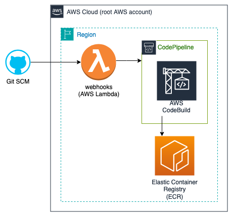

# Shared-service: Elastic Container Registry (ECR)
### **Table of Contents**
1. [Introduction](#1-introduction)
2. [Prerequisites](#2-Prerequisites)
3. [Getting Started](#3-getting-started)  
  3.1. [Create the repository](#31-create-the-repository)  
  3.2. [Configure the inputs](#32-configure-the-inputs)  
4. [Deploy Service](#4-deploy-service)  
  4.1. [Deploy Infrastructure](#41-deploy-infrastructure)  
  4.2. [Connect Webhooks](#42-connect-webhooks)  
  4.3. [Deploy Service](#43-deploy-service)  
5. [Appendix](#5-appendix)

## 1. **Introduction**

TODO:  
Current ARN: `arn:aws:ecr:us-east-2:538234414982:repository/launch-api`


<p align="center">
  
</p>

## 2. **Prerequisites:**

In order to use this guide successfully, there may be assumptions within your current environment. Please follow these other guides that are dependencies to successfully utilizes this one. 

Local development environment:
  - [MacOS local developer environment](./../../../../../development-environments/local/mac/README.md)
  - [Windows local developer environment](./../../../../../development-environments/local/java/windows/README.md)
  
## 3. **Getting Started** 

### 3.1. Configure the inputs


### 3.2. Create the repository


## 4. **Deploy service**

### Pre-flight
Ensure your environmental variable `GIT_TOKEN` is set and you are logged into aws cli.

```sh
$ export GIT_TOKEN="YOUR_TOKEN"
$ aws sso login --profile "YOUR_AWS_PROFILE"
```

### 4.1. Deploy Infrastructure


### 4.2. Connect Webhooks


### 4.3. Deploy Service


#### 4.3.1 Open and merge your first pull request (PR)


#### 4.3.2 Manually deploy service
If you cannot wait for the pipeline to deploy your service through the PR process, you can manually deploy your service.


## 5. Appendix 
- [Platform Application Naming Schema](./../../../../../standards/common-development/git/repository/naming-schemes/platform-sample-applications.md)