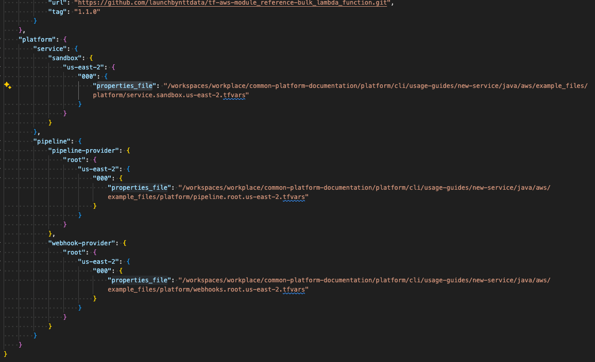
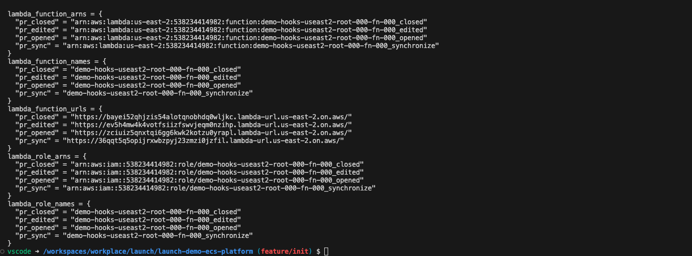
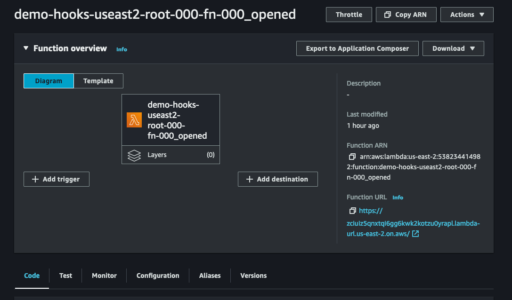
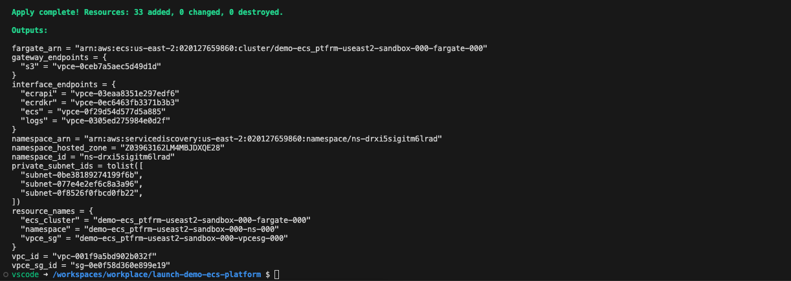

# Shared-service: Elastic Container Service (ECS)
### **Table of Contents**
1. [Introduction](#1-introduction)
2. [Prerequisites](#2-Prerequisites)
3. [Getting Started](#3-getting-started)  
  3.1. [Create the repository](#31-create-the-repository)  
  3.2. [Configure the inputs](#32-configure-the-inputs)  
4. [Deploy Service](#4-deploy-service)  
  4.1. [Deploy Infrastructure](#41-deploy-infrastructure)  
  4.2. [Connect Webhooks](#42-connect-webhooks)  
  4.3. [Deploy Service](#43-deploy-service)  
5. [Teardown Service](#5-teardown-service)
6. [Appendix](#6-appendix)

## 1. **Introduction**
This guide will deploy an Elastic Container Service (ECS) cluster compute platform to host an application along with the necessary infrastructure for CICD.

<p align="center">
  
</p>

## 2. **Prerequisites:**

In order to use this guide successfully, there may be assumptions within your current environment. Please follow these other guides that are dependencies to successfully utilizes this one. 

Local development environment:
  - [MacOS local developer environment](./../../../../development-environments/local/mac/README.md)
  - [Windows local developer environment](./../../../../development-environments/local/java/windows/README.md)
  
## 3. **Getting Started**

### 3.1. Configure the inputs
This guide has provided basic inputs to be used with the services we are deploying. However, we cannot use these right out of the box and we need to update some of the properties specific to your infrastructure. 

#### 3.1.1 Pipeline Properties
We are now going to update our pipeline properties with account spcific properties needed. We will be utilizing the pipeline file at the following location.
- [Pipeline `properties file` ./inputs/pipeline.root.us-east-2.tfvars](./inputs/pipeline.root.us-east-2.tfvars)


Update the following variables with spicific account information. Within each `sed` command, ensure you have the correct path to the pipeline properties file.  You can then run the entire block in the terminal to update the pipeline file.
```sh
# Update these variables
GITHUB_APPLICATION_ID='000000'
GITHUB_INSTALLATION_ID='00000000'
GITHUB_SIGNING_CERT_SECRET_NAME='github/app/aws-codepipeline-authentication/private_key'
ROOT_ACCOUNT_DEPLOY_ROLE='arn:aws:iam::111111111111:role/demo_iam-useast2-sandbox-000-role-000'
QA_ACCOUNT_DEPLOY_ROLE='arn:aws:iam::222222222222:role/demo_iam-useast2-sandbox-000-role-000'
UAT_ACCOUNT_DEPLOY_ROLE='arn:aws:iam::333333333333:role/demo_iam-useast2-sandbox-000-role-000'
PROD_ACCOUNT_DEPLOY_ROLE='arn:aws:iam::444444444444:role/demo_iam-useast2-sandbox-000-role-000'

sed -i "s|<GITHUB_APPLICATION_ID>|$GITHUB_APPLICATION_ID|g" ./pipeline.root.us-east-2.tfvars
sed -i "s|<GITHUB_INSTALLATION_ID>|$GITHUB_INSTALLATION_ID|g" ./pipeline.root.us-east-2.tfvars
sed -i "s|<GITHUB_SIGNING_CERT_SECRET_NAME>|"$GITHUB_SIGNING_CERT_SECRET_NAME"|g" ./pipeline.root.us-east-2.tfvars
sed -i "s|<ROOT_ACCOUNT_DEPLOY_ROLE>|$ROOT_ACCOUNT_DEPLOY_ROLE|g" ./pipeline.root.us-east-2.tfvars
sed -i "s|<QA_ACCOUNT_DEPLOY_ROLE>|$QA_ACCOUNT_DEPLOY_ROLE|g" ./pipeline.root.us-east-2.tfvars
sed -i "s|<UAT_ACCOUNT_DEPLOY_ROLE>|$UAT_ACCOUNT_DEPLOY_ROLE|g" ./pipeline.root.us-east-2.tfvars
sed -i "s|<PROD_ACCOUNT_DEPLOY_ROLE>|$PROD_ACCOUNT_DEPLOY_ROLE|g" ./pipeline.root.us-east-2.tfvars
```

#### 3.1.2 Webhook Properties
We are now going to update our pipeline properties with account spcific properties needed. We will be utilizing the pipeline file at the following location.
- [Webhooks `properties file` ./inputs/webhooks.root.us-east-2.tfvars](./inputs/webhooks.root.us-east-2.tfvars)


```sh
# Update these variables
GIT_SECRET_SM_ARN='arn:aws:secretsmanager:us-east-2:111111111111:secret:example/git/signature/secret'

sed -i "s|<GIT_SECRET_SM_ARN>|$GIT_SECRET_SM_ARN|g" ./webhooks.root.us-east-2.tfvars
```

#### 3.1.3 Service Properties
This example does not need any specific updates for the service properties and will work out of the box. 

#### 3.1.4 .launch_config
The launch config for the platform in this guide is at the following:
- [./inputs/.launch_config](./inputs/.launch_config)

Open this file and update the `properties_file` key with the absolute path from your system to the input files to be used, and then save it.

We are going to be using the following inputs for our `.launch_config` files. 
- [Service `properties file` ./inputs/service.sandbox.us-east-2.tfvars](./inputs/service.sandbox.us-east-2.tfvars)
- [Pipeline `properties file` ./inputs/pipeline.root.us-east-2.tfvars](./inputs/pipeline.root.us-east-2.tfvars)
- [Webhooks `properties file` ./inputs/webhooks.root.us-east-2.tfvars](./inputs/webhooks.root.us-east-2.tfvars)

<p align="center">
   
</p>

### 3.2. Create the repository
We are now going to create the ECS platform properties repository. This service is the ECS cluster that the java application will deploy too.

- Replace the path in the `--in-file` argument to the absolute path of the `.launch_config` file saved in the previous section. 
- We are going to use the `--name` of `launch-demo-ecs-platform` in this demo, but you can name it what ever you want.

```sh
$ launch service create --name launch-demo-ecs-platform --in-file /workspaces/workplace/common-platform-documentation/platform/common-automation-framework/shared-services/aws/ecs/inputs/.launch_config
```

<p align="center">
   
</p>

## 4. **Deploy service**

### Pre-flight
1. Please ensure you have generated a Github token and it is ready to use in your environment.
    - [Github Token](./../../../../development-environments/local/tools/token/README.md)

2. Please ensure you have set your AWS credentials.
    - If using SSO: [AWS SSO](./../../../../../development-environments/local/tools/aws/sso-login/README.md)
    - Standard config: [AWS cli](./../../../../../development-environments/local/tools/aws/cli/README.md)

### 4.1. Deploy Infrastructure
Deploy the pipeline for the ECS service. This step will deploy all the CICD pipeline infrastructure to manage this repository. 

```sh
$ cd launch-demo-ecs-platform # Ensure you are in the newly created repository's directory
$ launch terragrunt --target-environment root --platform-resource pipeline --apply --generation
```

<p align="center">
  <br>
  output truncated... <br>
  
</p>

Deploy the webhooks for the ECS service. This will deploy lambda functions that we can connect to a SCM for pull request building events and triggering deployment pipelines. 

```sh
$ launch terragrunt --target-environment root --platform-resource webhook --apply --generation
```

<p align="center">
  <br>
  output truncated... <br>
  
</p>

### 4.2. Connect webhooks
In this section, we will connect the webhooks we deployed to lambda to github. 

In the previous section when deploying the webhooks, there were outputs of the lambda function urls that will be needed for use in this section. 

```
lambda_function_urls = {
  "pr_closed" = "https://ezf4qxjpe3gcr4dwokpyhq5bz40tholo.lambda-url.us-east-2.on.aws/"
  "pr_edited" = "https://kiuq5yazpzdmklgb52ytf74eaa0vpyoo.lambda-url.us-east-2.on.aws/"
  "pr_opened" = "https://r4lt6fpncydxtxvsiv4bwoxvyq0cibpa.lambda-url.us-east-2.on.aws/"
  "pr_sync" = "https://ajeswab6dtejbj6vbjxdsssgsa0hyylg.lambda-url.us-east-2.on.aws/"
}
```

Alternatively, you can find the function URL by navigating to the lambdas in the AWS console.

<p align="center">
  <br>
  
</p>

Using `launch-cli`, you will need to run this for each of the 4 lambdas' functional URLs.

[WARNING]: You can not copy and paste this command directly. You need to update `MY_SECRET` with the value of the git secret created in the Secrets Manager section.

```sh
$ launch github hooks create --repository-name launch-demo-ecs-platform --events '["pull_request"]'  --secret MY_SECRET --url FUNCTION_URL_1
$ launch github hooks create --repository-name launch-demo-ecs-platform --events '["pull_request"]'  --secret MY_SECRET --url FUNCTION_URL_2
$ launch github hooks create --repository-name launch-demo-ecs-platform --events '["pull_request"]'  --secret MY_SECRET --url FUNCTION_URL_3
$ launch github hooks create --repository-name launch-demo-ecs-platform --events '["pull_request"]'  --secret MY_SECRET --url FUNCTION_URL_4
```

<p align="center">
  
</p>

The webhooks will initially fail as the lambda does not allow ping requests.

<p align="center">
  
</p>


### 4.3. Deploy Service

#### 4.3.2 Manually deploy service
Deploy the ECS service. This is the actual ECS cluster. 

```sh
$ cd launch-demo-ecs-platform # Ensure you are in your created repository's directory
$ launch terragrunt --target-environment sandbox --platform-resource service --apply --generation
```

<p align="center">
  <br>
  output truncated... <br>
  
</p>

#### 4.3.1 Open and merge your first pull request (PR)


## 5. **Teardown Service**
```sh
launch terragrunt --target-environment root --platform-resource pipeline --destroy --generation
launch terragrunt --target-environment root --platform-resource webhook --destroy --generation

# For each environment deployed
launch terragrunt --target-environment sandbox --platform-resource service --destroy --generation
launch terragrunt --target-environment qa --platform-resource service --destroy --generation
launch terragrunt --target-environment uat --platform-resource service --destroy --generation
launch terragrunt --target-environment prod --platform-resource service --destroy --generation
```

## 6. **Appendix**
- [Compatibility Matrix](./../../../../README.md)
- [Platform Application Naming Schema](./../../../../../standards/common-development/git/repository/naming-schemes/platform-sample-applications.md)
- [MacOS local developer environment](./../development-environments/local/mac/README.md)
- [Windows local developer environment](./../development-environments/local/windows/README.md)
