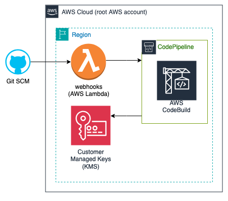

# Shared-service: Key Management Service (KMS)
### **Table of Contents**
1. [Introduction](#1-introduction)
2. [Prerequisites](#2-Prerequisites)
3. [Getting Started](#3-getting-started)  
  3.1. [Create the repository](#31-create-the-repository)  
  3.2. [Configure the inputs](#32-configure-the-inputs)  
4. [Deploy Service](#4-deploy-service)  
  4.1. [Deploy Infrastructure](#41-deploy-infrastructure)  
  4.2. [Connect Webhooks](#42-connect-webhooks)  
  4.3. [Deploy Service](#43-deploy-service)  
5. [Teardown Service](#5-teardown-service)
6. [Appendix](#6-appendix)

## 1. **Introduction**

TODO:  
Current ARN: 
```sh
arn:aws:kms:us-east-2:020127659860:key/48fbe6bf-0cab-49bd-aca6-7ebe92c20455`  
Key alias: example/kms/key
```

<p align="center">
  
</p>

## 2. **Prerequisites:**

In order to use this guide successfully, there may be assumptions within your current environment. Please follow these other guides that are dependencies to successfully utilizes this one. 

Local development environment:
  - [MacOS local developer environment](./../../../../../development-environments/local/mac/README.md)
  - [Windows local developer environment](./../../../../../development-environments/local/java/windows/README.md)

## 3. **Getting Started**

### 3.1. Configure the inputs


### 3.2. Create the repository
We are now going to create the KMS properties repository.

- Replace the path in the `--in-file` argument to the absolute path of the `.launch_config` file saved in the previous section. 
- We are going to use the `--name` of `launch-demo-kms` in this demo, but you can name it what ever you want.

```sh
$ launch service create --name launch-demo-kms --in-file /workspaces/workplace/common-platform-documentation/platform/common-automation-framework/shared-services/aws/kms/inputs/.launch_config
```

<p align="center">
   
</p>

## 4. **Deploy service**

### Pre-flight
1. Please ensure you have generated a Github token and it is ready to use in your environment.
    - [Github Token](./../../../../development-environments/local/tools/token/README.md)

2. Please ensure you have set your AWS credentials.
    - If using SSO: [AWS SSO](./../../../../../development-environments/local/tools/aws/sso-login/README.md)
    - Standard config: [AWS cli](./../../../../../development-environments/local/tools/aws/cli/README.md)

### 4.1. Deploy Infrastructure


### 4.2. Connect Webhooks
In this section, we will connect the webhooks we deployed to lambda to github. 

In the previous section when deploying the webhooks, there were outputs of the lambda function urls that will be needed for use in this section. 

```
lambda_function_urls = {
  "pr_closed" = "https://ezf4qxjpe3gcr4dwokpyhq5bz40tholo.lambda-url.us-east-2.on.aws/"
  "pr_edited" = "https://kiuq5yazpzdmklgb52ytf74eaa0vpyoo.lambda-url.us-east-2.on.aws/"
  "pr_opened" = "https://r4lt6fpncydxtxvsiv4bwoxvyq0cibpa.lambda-url.us-east-2.on.aws/"
  "pr_sync" = "https://ajeswab6dtejbj6vbjxdsssgsa0hyylg.lambda-url.us-east-2.on.aws/"
}
```

Alternatively, you can find the function URL by navigating to the lambdas in the AWS console.

<p align="center">
  <br>
  
</p>

Using `launch-cli`, you will need to run this for each of the 4 lambdas' functional URLs.

[WARNING]: You can not copy and paste this command directly. You need to update `MY_SECRET` with the value of the git secret created in the Secrets Manager section.

```sh
$ launch github hooks create --repository-name launch-demo-kms --events '["pull_request"]'  --secret MY_SECRET --url FUNCTION_URL_1
$ launch github hooks create --repository-name launch-demo-kms --events '["pull_request"]'  --secret MY_SECRET --url FUNCTION_URL_2
$ launch github hooks create --repository-name launch-demo-kms --events '["pull_request"]'  --secret MY_SECRET --url FUNCTION_URL_3
$ launch github hooks create --repository-name launch-demo-kms --events '["pull_request"]'  --secret MY_SECRET --url FUNCTION_URL_4
```

<p align="center">
  
</p>

The webhooks will initially fail as the lambda does not allow ping requests.

<p align="center">
  
</p>

### 4.3. Deploy Service

#### 4.3.2 Manually deploy service
Deploy the KMS service. This is the actual KMS key. 

```sh
$ cd launch-demo-kms # Ensure you are in your created repository's directory
$ launch terragrunt --target-environment sandbox --platform-resource service --apply --generation
```

<p align="center">
  <br>
  output truncated... <br>
  
</p>

#### 4.3.1 Open and merge your first pull request (PR)

## 5. **Teardown Service**

## 6. **Appendix**
- [Platform Application Naming Schema](./../../../../../standards/common-development/git/repository/naming-schemes/platform-sample-applications.md)