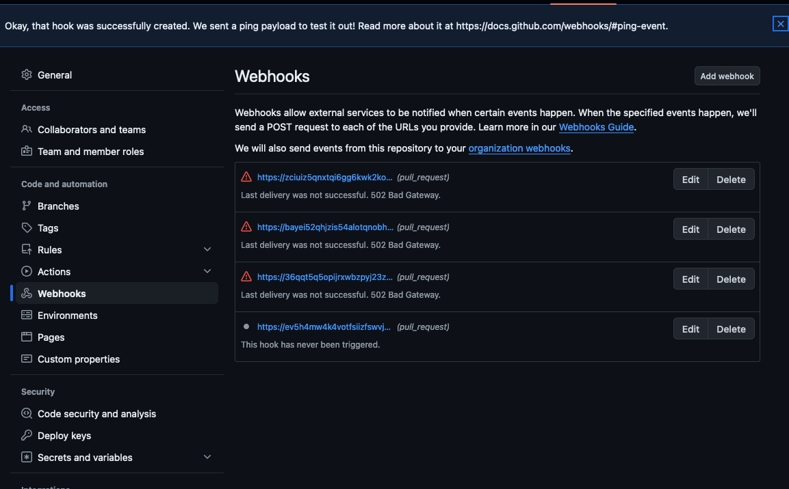

# Usage Guide: Create and deploy a new Java service [AWS] (1.5 hours)
## **Table of Contents**
1. [Introduction](#1-introduction)
2. [Prerequisites](#2-Prerequisites)
3. [Deploy Infrastructure](#3-deploy-infrastructure)
4. [Deploy Java Application](#4-deploy-java-application)
5. [View the Java Application](#5-view-the-java-application)
6. [Maintenance](#6-maintenance)

## 1. **Introduction**
This guide will describe how to deploy a new java service using Launch's cli utility `launch-cli`. Within this guide, we will deploy necessary infrastructure to host a container application. Among the infrastructure, We need to deploy an ECR repository to store the new java containers being built. Secrets Manager to host your container's secrets. Finally, it will deploy an ECS cluster to support and serve the new java service. 

High level diagram of the architecture we are going to create in this guide.

<p align="center">
   
</p>

This guide has been modified to work with the following providers:

- Service provider: **AWS**
- Pipeline provider: **AWS**

External dependencies:
- [Java application built to Launch's requirements.](#TODO)This guide will use the following repository: 
  - [https://github.com/launchbynttdata/launch-api-hex-java-template](https://github.com/launchbynttdata/launch-api-hex-java-template)

## 2. **Prerequisites:**

In order to use this guide, it is assumed your local development environment is set up to use the `launch-cli` platform. To log into your aws credentials, you can utilize the `aws sso utils`. Here is a list of complete guides to follow to set up your local development environment before this guide can be used successfully.

- Setting up local environment:
  - [Mac](./../../../../../development-environments/local/java/mac/README.md)
  - [Windows](./../../../../../development-environments/local/java/windows/README.md)
- [Setting up AWS config](./../../../../../development-environments/local/aws/config/README.md)
- [Setting up `aws-sso-utils`](./../../../../../development-environments/local/aws/sso-login/README.md)
- [Setting up Visual Studio Code](./../../../../../development-environments/local/vscode/README.md) (Optional)
- [Setting up Visual Studio Code dev containers](./../../../../../development-environments/local/vscode/dev-containers/README.md) (Optional)
- [Installing launch-cli](./../../../../README.md)
- [Configuring Github Personal Access Token](./../../../../../development-environments/local/token/README.md)

## 3. **Deploy Infrastructure**

### 3.1 Deploy KMS Key 
In this section, we will be deploying the KMS keys needed for our secrets.

TODO:

current: `arn:aws:kms:us-east-2:538234414982:key/ba37724b-ea39-45a5-a938-713fb9f88112` 
Alias: `demo/example/kms`

#### 3.1.1 Create the inputs for the KMS 
#### 3.1.2 Create the KMS service
#### 3.1.3 Generate the Terragrunt files for the KMS service
#### 3.1.4 Deploy the KMS service
#### 3.1.5 Connect the webhooks

### 3.2 Deploy Secrets Manager 
In this section, we will be deploying the secrets needed for our platform and java application.

TODO:

Current:
```
arn:aws:secretsmanager:us-east-2:538234414982:secret:github/launchbynttdata/tg-aws-shared-ecs_platform/git_secret
arn:aws:secretsmanager:us-east-2:538234414982:secret:launch/dso-platform/github/service_user/http_access_token
arn:aws:secretsmanager:us-east-2:538234414982:secret:launch/dso-platform/github/service_user/username
arn:aws:secretsmanager:us-east-2:538234414982:secret:example/postgres/username
arn:aws:secretsmanager:us-east-2:538234414982:secret:example/postgres/password
arn:aws:secretsmanager:us-east-2:538234414982:secret:example/actuator/username
arn:aws:secretsmanager:us-east-2:538234414982:secret:example/actuator/password
```

#### 3.2.1 Create the inputs for the Secrets Manager 
#### 3.2.2 Create the Secrets Manager service
#### 3.2.3 Generate the Terragrunt files for the Secrets Manager service
#### 3.2.4 Deploy the Secrets Manager service
#### 3.2.5 Connect the webhooks

### 3.3 Deploy IAM roles 
In this section, we will be deploying the IAM roles needed for our platform and java application. 

TODO:
#### 3.3.1 Create the inputs for the IAM roles
#### 3.3.2 Create the IAM roles service
#### 3.3.3 Generate the Terragrunt files for the IAM roles service
#### 3.3.4 Deploy the IAM roles service
#### 3.3.5 Connect the webhooks

### 3.4 Deploy ECR Repository
In this section, we will be deploying the necessary infrastructure to store our java image built. 

current: `arn:aws:ecr:us-east-2:538234414982:repository/launch-api`

TODO:
#### 3.4.1 Create the inputs for the ECR Repository 
#### 3.4.2 Create the ECR Repository service
#### 3.4.3 Generate the Terragrunt files for the ECR Repository service
#### 3.4.4 Deploy the ECR Repository service
#### 3.4.5 Connect the webhooks

### 3.5 Deploy ECS Platform
In this section, we will be deploying the ECS platform that our application will be deployed onto. 

#### 3.5.1 Create the inputs for the ECS Platform
This guide has provided basic inputs to be used with the services we are deploying. However, we cannot use these right out of the box and we need to quickly update some paths within our `.launch_config` file.

The launch config for the platform in this guide is at the following:
- [./example_files/platform/.launch_config](./example_files/platform/.launch_config)

Open this file and update the `properties_file` key with the absolute path from your system to the input files to be used, and then save it.

We are going to be using the following inputs for our `.launch_config` files. 
- [Service `properties file` ./example_files/platform/service.sandbox.us-east-2.tfvars](./example_files/platform/service.sandbox.us-east-2.tfvars)
- [Pipeline `properties file` ./example_files/platform/pipeline.root.us-east-2.tfvars](./example_files/platform/pipeline.root.us-east-2.tfvars)
- [Webhooks `properties file` ./example_files/platform/webhooks.root.us-east-2.tfvars](./example_files/platform/webhooks.root.us-east-2.tfvars)

<p align="center">
   
</p>

#### 3.5.2 Create the ECS Platform service
We are now going to create the ECS platform properties repository.
Replace the path in the `--in-file` argument to the absolute path of the `.launch_config` file saved in the previous section. 
```
$ launch service create --name launch-demo-ecs-platform --in-file /workspaces/workplace/common-platform-documentation/platform/common-automation-framework/usage-guides/new-service/java/aws/example_files/platform/.launch_config
```
<p align="center">
   
</p>

#### 3.5.3 Generate the Terragrunt files for the ECS Platform service

Change into the directory of the newly created service. Once inside the new repositories' directory, generate the Terragrunt code.

```
$ cd sample-demo-app
$ launch service generate
```
<p align="center">
   
</p>

<p align="center">
   
</p>

#### 3.5.4 Deploy the ECS Platform service

Deploy the pipeline for the ECS Platform service
```
$ launch terragrunt --target-environment root --platform-resource pipeline --apply --generation
```
<p align="center">
  <br>
  output truncated... <br>
  
</p>

Deploy the webhooks for the ECS Platform service

```
$ launch terragrunt --target-environment root --platform-resource webhook --apply --generation
```
<p align="center">
  <br>
  output truncated... <br>
  
</p>

Deploy the ECS Platform service
```
$ launch terragrunt --target-environment sandbox --platform-resource service --apply --generation
```
<p align="center">
  <br>
  output truncated... <br>
  
</p>


#### 3.5.5 Connect the webhooks
Navigate to your organization's SCM, this guide will be using Github.

In Github, navigate to the newly created repository. Under `Settings`, navigate to `Webhooks` and click `Add webhook`.
<p align="center">
   
</p>

We are going to create webhooks for each of the lambdas (4). 
- In `Payload URL` put the function URL of the lambda
- In `Content type`, select `application/json`
- In `Secret`, paste your git_lambda_secret created earlier.
- Select `Let me select individual events`
  - Only select `Pull requests`

<p align="center">
  <br>
  
</p>

You can find the function URL from the output after running the `launch terragrunt` command to deploy the webhooks or by navigating to the lambdas in the AWS console.
<p align="center">
  <br>
  
</p>

<p align="center">
  
</p>

The webhooks will initially fail as the lambda does not allow ping requests.

## 4. **Deploy Java application**

#### 4.1.1 Create the inputs for the Java application

The launch config for the application in this guide is at the following:
- [./example_files/application/.launch_config](example_files/application/.launch_config)

Open this file and update the `properties_file` key with the absolute path from your system to the input files to be used, and then save it.

We are going to be using the following inputs for our `.launch_config` files. 
- [Service `properties file` ./example_files/application/service.sandbox.us-east-2.tfvars](./example_files/application/service.sandbox.us-east-2.tfvars)
- [Pipeline `properties file` ./example_files/application/pipeline.root.us-east-2.tfvars](./example_files/application/pipeline.root.us-east-2.tfvars)
- [Webhooks `properties file` ./example_files/application/webhooks.root.us-east-2.tfvars](./example_files/application/webhooks.root.us-east-2.tfvars)

This file also includes 2 other files for jinja templates. Update these paths as well.
- [Application inputs `properties file` ./example_files/application/service.sandbox.us-east-2.tfvars](./example_files/application/common-application-config-non-secret.env.jinja2)
- [Application secrets `properties file` ./example_files/application/pipeline.root.us-east-2.tfvars](./example_files/application/common-application-config-secret.env.jinja2)


Open this file and update the `properties_file` key with the absolute path from your system to the input files to be used and then save it.
<p align="center">
   
</p>

#### 4.1.2 Create the Java application service
We are now going to create the Java application properties repository.
Replace the path in the `--in-file` argument to the absolute path of the `.launch_config` file saved in the previous section. 
```
$ launch service create --name launch-demo-ecs-application --in-file /workspaces/workplace/common-platform-documentation/platform/common-automation-framework/usage-guides/new-service/java/aws/example_files/application/.launch_config
```
<p align="center">
   
</p>

#### 4.1.3 Build the image and push
Change into the directory of the newly created service. Once inside the new repositories' directory, build the application's Docker image and push it to a container repository. 
```
$ cd launch-demo-ecs-application
$ launch service build --container-registry "020127659860.dkr.ecr.us-east-2.amazonaws.com" --container-image-name "launch-api" --container-image-version "0.0.1-dev" --push
```
<p align="center">
   <br>
   <br>
  output truncated... <br>
  
</p>

#### 4.1.4 Generate the Terragrunt files for the Java application service
Generate the Terragrunt code of the Java application.

```
$ launch service generate
```
<p align="center">
   
</p>

#### 4.1.5 Deploy the Java application service

Deploy the pipeline for the Java application service
```
$ launch terragrunt --target-environment root --platform-resource pipeline --apply --generation
```
<p align="center">
  <br>
  output truncated... <br>
  
</p>

Deploy the webhooks for the Java application  service
```
$ launch terragrunt --target-environment root --platform-resource webhook --apply --generation
```
<p align="center">
  <br>
  output truncated... <br>
  
</p>

Deploy the Java application service
```
$ launch terragrunt --target-environment sandbox --platform-resource service --apply --generation --render-app-vars
```
<p align="center">
  <br>
  output truncated... <br>
  
</p>

#### 4.1.6 Connect the webhooks
Within this section, we need to connect the webhooks for the newly created service and the Java application. Both of these repositories will utilize the same webhooks.

In this first section, we will connect the new created repository.
- In Github, navigate to the newly created repository. Under `Settings`, navigate to `Webhooks` and click `Add webhook`.
<p align="center">
   
</p>

We are going to create webhooks for each of the lambdas (4) for the properties repo.
- In `Payload URL` put the function URL of the lambda
- In `Content type`, select `application/json`
- In `Secret`, paste your git_lambda_secret created earlier.
- Select `Let me select individual events`
  - Only select `Pull requests`

<p align="center">
  <br>
  
</p>


We will now connect the webhooks for the Java application
- In Github, navigate to the Java application repository. Under `Settings`, navigate to `Webhooks` and click `Add webhook`.
<p align="center">
   
</p>

We are going to create webhooks for each of the lambdas (4) for the Java Application. 
- In `Payload URL` put the function URL of the lambda
- In `Content type`, select `application/json`
- In `Secret`, paste your git_lambda_secret created earlier.
- Select `Let me select individual events`
  - Only select `Pull requests`

<p align="center">
  <br>
  
</p>

## 5. **View the Java Application**

Perform this guide to deploy a AWS Client VPN utilizing the launch platform to view this application in a private VPC:

- [Deploy Client VPN](#TODO)
- [Configure VPN Client](#TODO)

Once able to connect to the private VPC your application is running in, navigate to [http://vpn-poc-nlb1-84d114247ebc21eb.elb.us-east-2.amazonaws.com:8080/swagger-ui/index.html](http://vpn-poc-nlb1-84d114247ebc21eb.elb.us-east-2.amazonaws.com:8080/swagger-ui/index.html). You should now see your running application. 

<p align="center">
  <br>
</p>


## 6. **Maintenance**