# MacOS local developer environment (0.5 hours)
## **Table of Contents**
1. [Introduction](#1-introduction)
2. [Prerequisites](#2-prerequisites)
3. [Tool Installation](#3-tool-installation)  
  3.1. [Homebrew](#31-homebrew)  
  3.2. [asdf](#31-asdf)  
  3.3. [IntelliJ IDEA](#33-intellij-idea)  
  3.4. [Docker](#34-docker)
4. [Development Environment](#4-development-environment)  
  4.1. [Platform Container](#41-platform-container)  
  4.2. [Local Dev Container](#42-local-dev-container)  
  4.3. [Build Container](#43-build-container)  
  4.4. [Build tools](#44-build-tools)  
5. [References](#5-references)

## 1. **Introduction**

This guide will walk you through setting up a local developer environment on a MacOS device. It provides instructions on how to install Homebrew, asdf version manager, IntelliJ IDEA, JavaSDK, and Gradle. In addition, it provides links on how to set up a development environment with using either the Launch platform container, a local developer container, or utilizing local build methods. 

## 2. Prerequisites:
1. MacOS 14.5+ M1.
2. User has rights to install softwares and change permissions as required on their machine.

## 3. Tool Installation

Within this section we will deploy all the tools need to set up a local developer environment. We will install Homebrew, asdf, IntelliJ and Docker. Within IntelliJ, we will set up various builder tools just as Java and Gradle. 

### 3.1 Homebrew

In this section, we will install Homebrew on the local machine. 

1. Open Terminal.

<p align="center">
   
</p>

2. Install Homebrew by running the following command:

    ```sh
    $ /bin/bash -c "$(curl -fsSL https://raw.githubusercontent.com/Homebrew/install/HEAD/install.sh)"
    ```

<p align="center">
  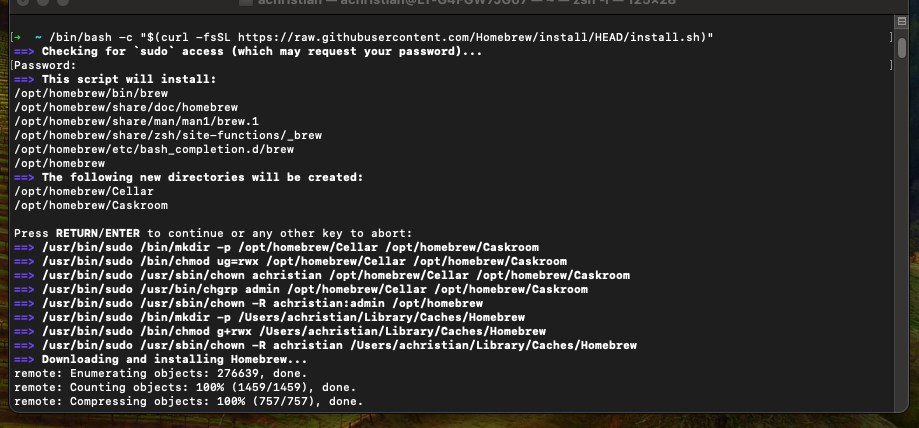 
</p>

3. Once the installation is complete, verify it by running:

    ```sh
    $ brew --version
    ```

<p align="center">
  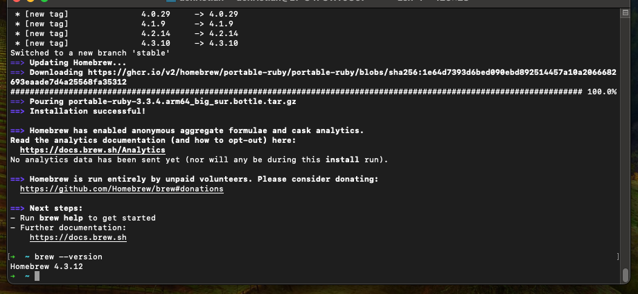 
</p>

### 3.2 asdf

In this section, we will install asdf on the local machine through Homebrew. 

1. Open Terminal.

<p align="center">
  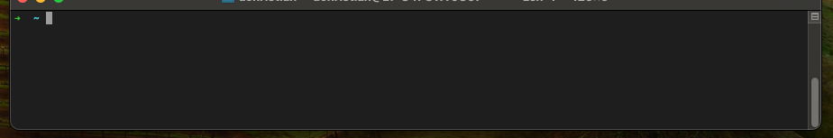 
</p>

2. Install `asdf` by running the following commands:

    ```sh
    $ brew install coreutils curl git
    $ brew install asdf
    ```

<p align="center">
  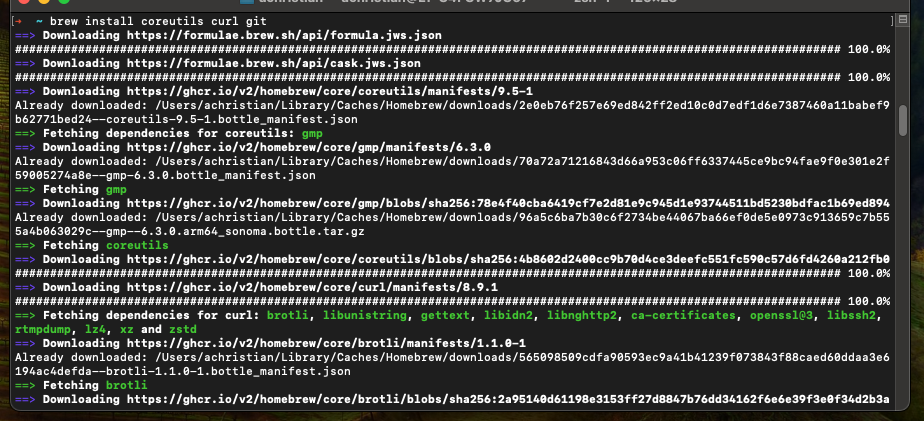 </br>
  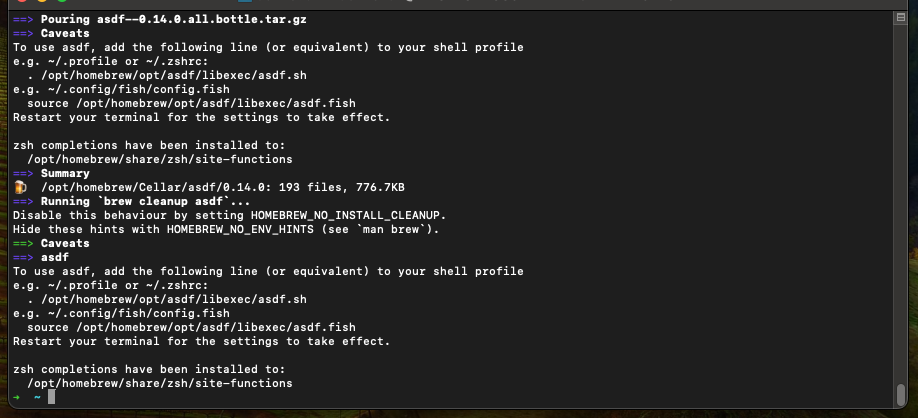 
</p>

3. Add `asdf` to your shell by running the following commands:

    ```sh
    $ echo -e "\n. $(brew --prefix asdf)/libexec/asdf.sh" >> ~/.zshrc
    $ source ~/.zshrc
    ```

<p align="center">
  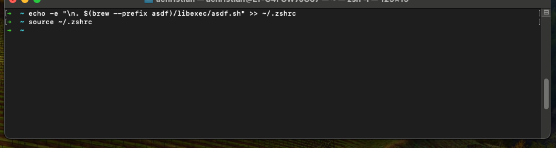 
</p>

4. Verify the installation by running:

    ```sh
    asdf --version
    ```

<p align="center">
  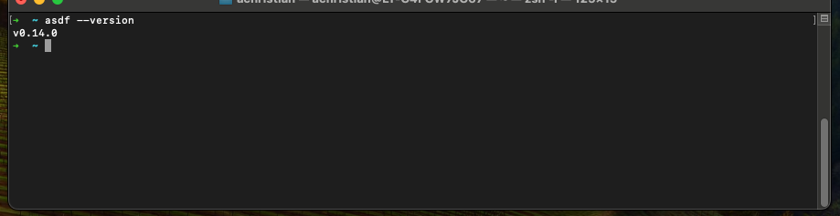 
</p>

### 3.3 IntelliJ IDEA

In this section, we will install IntelliJ on the local machine. 

1. [Download](https://www.jetbrains.com/idea/download/?section=mac) Intellij

<p align="center">
  <a href="https://www.jetbrains.com/idea/download/?section=mac">
     
  </a>
</p>

2. Run the installer, specify path for installation

<p align="center">
  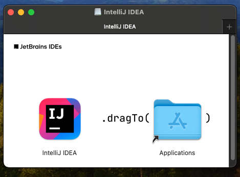 
</p>

3. Open IntelliJ IDE and select a project to open

    - If you need to activate your license, please follow these [official guides](https://www.jetbrains.com/help/idea/register.html#start_trial).
<p align="center">
   
</p>


Within IntelliJ enable support for the following builder tools:
####  <u>Java JDK</u>

- Open a project in Intellij IDE
<p align="center">
   
</p>
- Click on the gear icon in the top right, `IDE and Project Settings` and click `Project Structure`

<p align="center">
   
</p>

- A New window will pop up. Click `SDKs` in the left menu. Then Click the `+` sign and then `Download JDK`

<p align="center">
  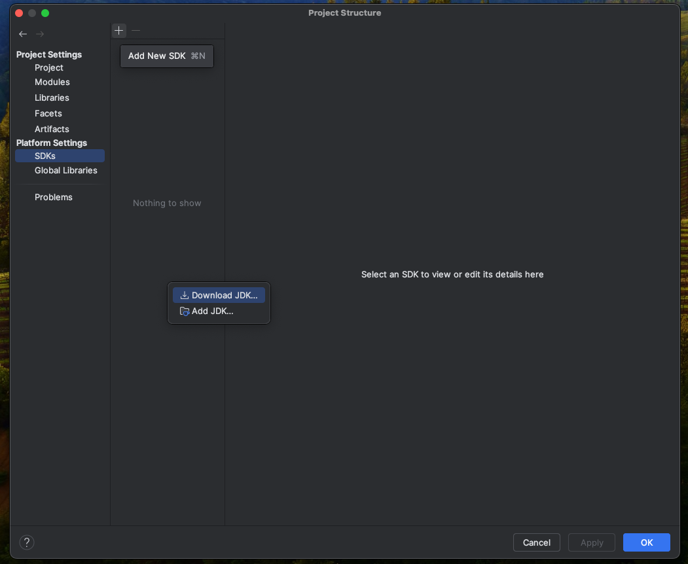 
</p>

- Select version `17`, then `Amazon Corretto 17`. Click `Download`.

<p align="center">
  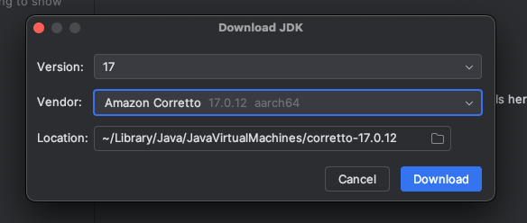 
</p>

- After downloaded, click `Ok`
<p align="center">
  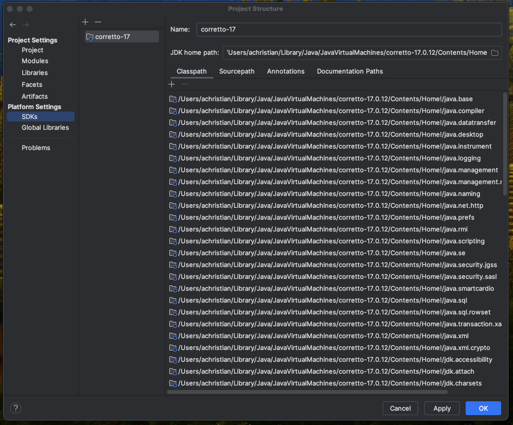 
</p>

- Launch a terminal and type the following to ensure java was installed.
```sh
$ java --version
```
<p align="center">
  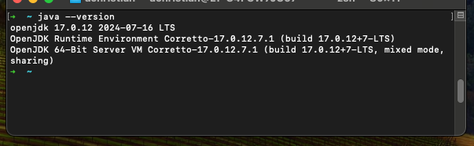 
</p>
- Run the command in terminal to set JAVA_HOME "export JAVA_HOME=/Library/Java/JavaVirtualMachines/amazon-corretto-17.jdk/Contents/Home"
- Add the jdk/bin path to system path variable PATH=$JAVA_HOME/bin:$PATH

- Run the following commands to set you `JAVA_HOME` and `PATH`
```sh
$ echo 'export JAVA_HOME="/Library/Java/JavaVirtualMachines/amazon-corretto-17.jdk/Contents/Home"' >> ~/.zshrc
$ echo 'export PATH="$JAVA_HOME/bin:$PATH"' >> ~/.zshrc
$ source ~/.zshrc
```

#### TroubleShooting JDK Installation
- Check if there are any pre-existing Java installs. Uninstall them and reinstall again
- Temporarily turn off firewalls and antivirus software.
- If you get file corrupt message, download the installation file again.
- Ensure you are making use of the right java download.

####  <u>Gradle</u>
- IntelliJ IDE has in built Gradle support. Click on the gear icon in the top right, `IDE and Project Settings` and click `Settings`

<p align="center">
  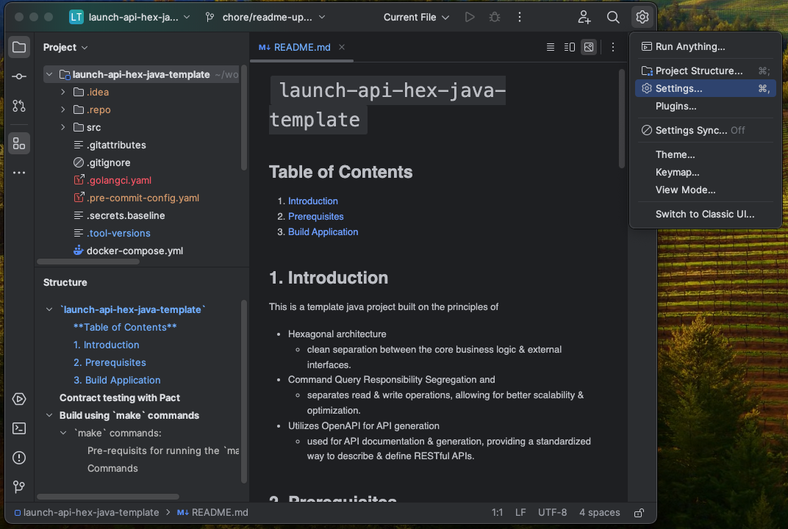 
</p>

- Click on `Build, Execution, Deployment` -> `Build Tools` -> `Gradle`, then click on `Ok`

<p align="center">
   
</p>

### 3.4 Docker

In this section, we will install Docker on the local machine. 

1. [Download](https://www.docker.com/products/docker-desktop/) Mac Docker Desktop

<p align="center">
  <a href="https://www.docker.com/products/docker-desktop/">
    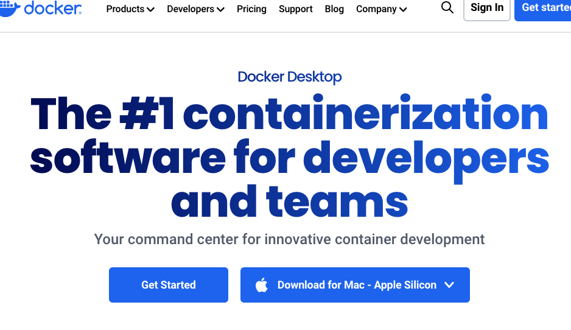
  </a>
</p>

2. Run the installer

<p align="center">
  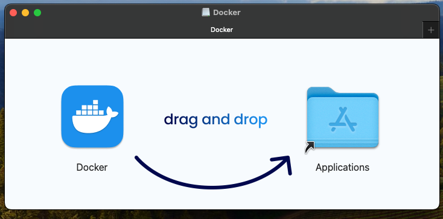 
</p>

3. Open the Docker Desktop application. All the containers running will be shown in the dashboard.

<p align="center">
  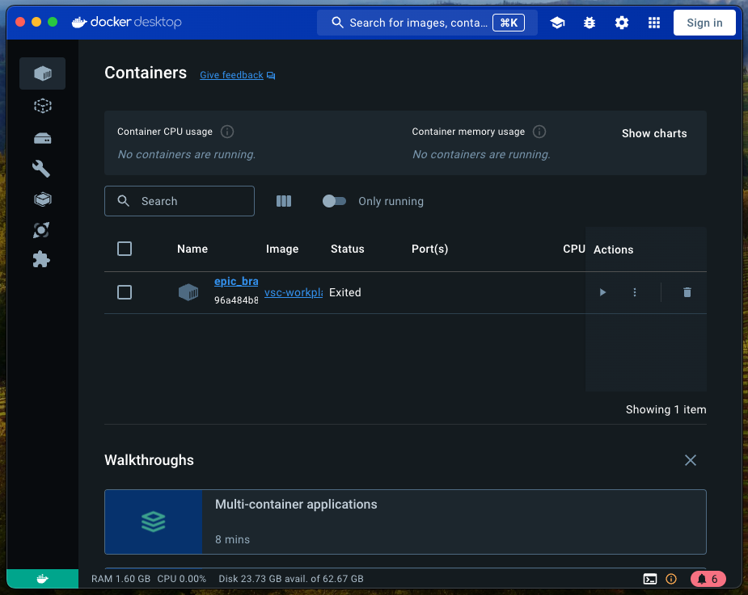 
</p>

## 4 Development Environment

A developer has a few different options to build and test their application. This section provides different options and only one of them needs to be chosen to develop, build, and test your application on your local machine.

##### Prerequisites
1. User should have access to Elastic Container Registry (ECR), in AWS cloud to push/pull the images.
2. Login to AWS environment using terminal where rest of the commands will be executed. `<aws profile name>` is the name of the aws profile that user has created for `sso login`
```sh
$ aws sso login --profile '<aws profile name>'
$ export AWS_PROFILE='<aws profile name>'
```

### 4.1 Platform Container
TODO:

### 4.2 Local Dev Container
Launch platform includes support to utilize a common local developer container through your IDE. This Dev Container has all the tools and software loaded and configured to build and test utilizing the Launch platform. Please follow the following guides to utilize this method.

- [Setting up IntelliJ dev containers](./../../../development-environments/local/tools/intellij/dev-containers/README.md)
- [Setting up Visual Studio Code dev containers](./../../../development-environments/local/tools/vscode/dev-containers/README.md)

Utilize the `launch-cli` commands of the following to build and push.
```sh
$ launch service build
$ launch service build --push
```

<p align="center">
  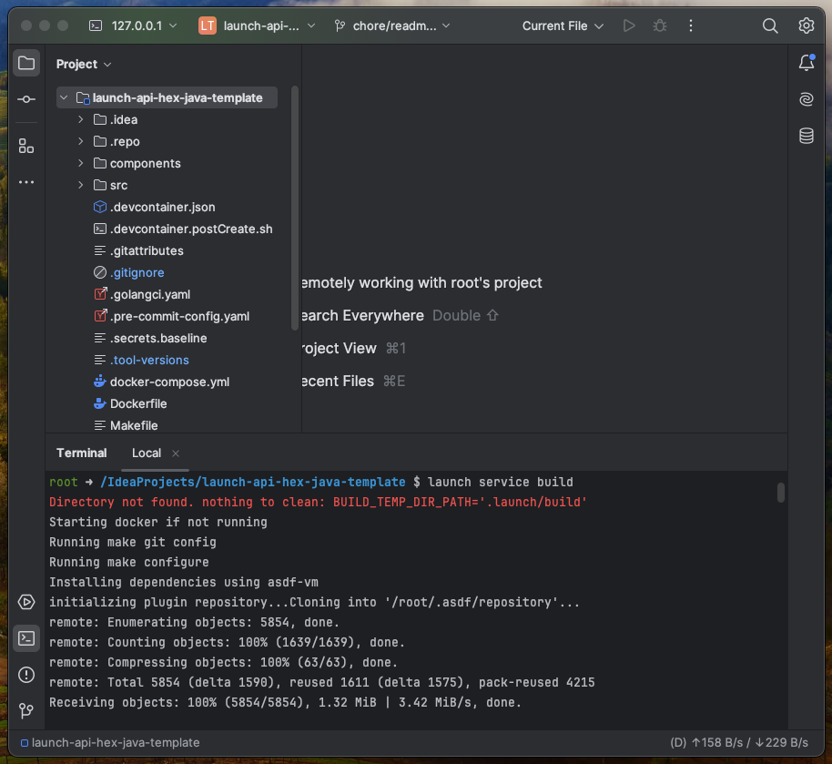 
</p>


### 4.3 Build Container

Launch Common Automation Framework (LCAF) offers standard set of commands to build/test/deploy applications written in different programming languages and architectures. It is achieved with help of `make` commands. The set of commands described below explain the process of building a docker image for a java application, starting the application locally, bringing it down and pushing the image to the remote repository.

#### Make commands
1. `make configure`: This command uses `git repo` tool to fetch dependent repositories which store the code for underlining commands to run `make` commands mentioned below. `make configure` pulls `lcaf-component-container` repository which stores the code for underlining `make` commands.

2. `make docker/check-env-vars`: Variables are stored in `Makefile.includes` file. The values of these variables, `CONTAINER_REGISTRY, CONTAINER_IMAGE_NAME, CONTAINER_IMAGE_VERSION`, can be changed so we customize the image name, version number and container registry name. The `make` commands ensures these values are present. This command does validation check.

3. `make docker/build`: This command builds the image using `Dockerfile`

4. `make docker_compose/start`: This command runs `docker-compose up` command to start the application locally.

5. `make docker_compose/stop`: This command runs `docker-compose up` command to stop the application locally.

6. `make docker/aws_ecr_login`: This commands obtains authentication token to login to CONTAINER_REGISTRY in AWS cloud so that docker image can be pushed to the registry.

7. `make docker/push`: This command builds and pushes the image to the container registry.

### 4.4 Build tools

The final method a user can use to build and test their application is utilizing the base level tools themselfs. The user can run Docker, Gradle or Maven commands directly if they choose. 

#### <u>Build using docker</u>
1. Run the application in docker with postgres
    - `docker build . -t launch-api:s1`
    - `docker-compose up`: Create and start containers defined in a Docker Compose file.
    - `docker-compose down`: Stop and remove containers defined in a Docker Compose file.
    - use PgAdmin service to view the table & daa: http://localhost:5050/browser
        - https://medium.com/@marvinjungre/get-postgresql-and-pgadmin-4-up-and-running-with-docker-4a8d81048aea
    1. If you are using H2 database you can connect to the H2 console: http://localhost:8087/h2-console (no password needed, just click "Connect").
3. Connect to the actuator with the credentials "test/test": http://localhost:8087/actuator
4. Open the API Docs: http://localhost:8087/swagger-ui.html

#### Contract testing with Pact
- the contact files are created when the consumer pact tests are run & can be found under the build/pacts.
- run `docker-compose up` to start the pact broker.
- run `./gradlew pactPublish` to push the contract to the broker.

## 5. References
- [Homebrew official](https://brew.sh/) install guide
- [asdf official](https://asdf-vm.com/guide/getting-started.html) install guide
- [IntelliJ official](https://www.jetbrains.com/help/idea/installation-guide.html#-u36bwj_90) install guide
- [Docker official](https://docs.docker.com/desktop/install/mac-install/) install guide