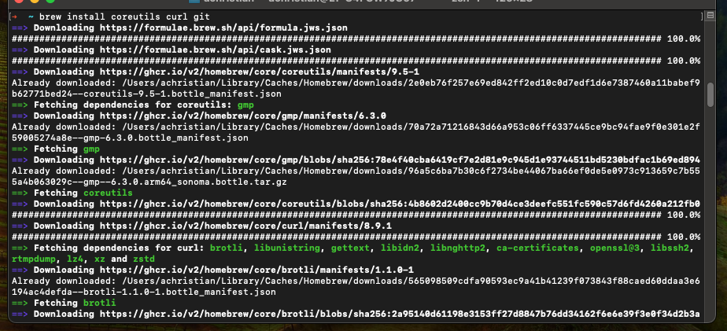
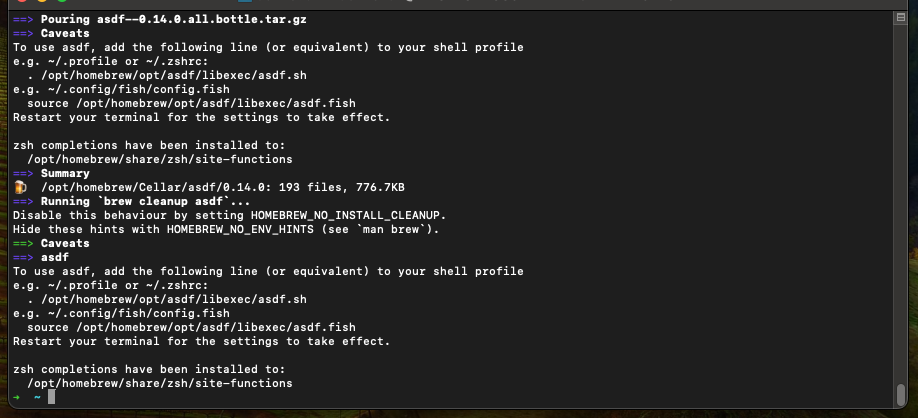
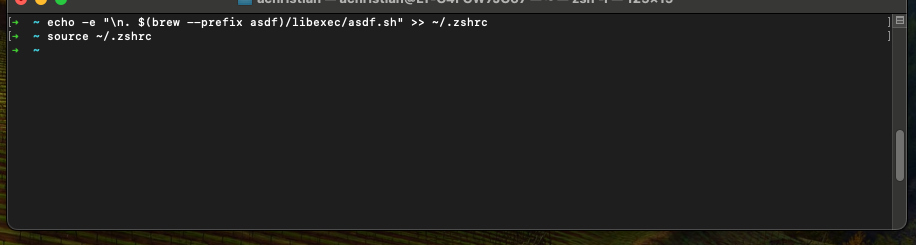
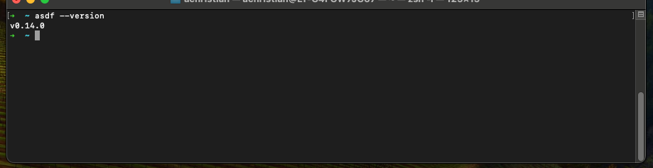

# asdf
## **Table of Contents**
1. [Introduction](#1-introduction)
2. [Prerequisites](#2-prerequisites)
3. [Install asdf](#3-install-asdf)  
    3.1. [MacOS local](#31-macos-local)  
    3.2. [Windows local](#31-windows-local) 
4. [Appendix](#4-appendix)

## 1. **Introduction**

## 2. **Prerequisites**
In order to use this guide successfully, there may be assumptions within your current environment. Please follow these other guides that are dependencies to successfully utilizes this one. 

Local development environment:  
- [MacOS local developer environment](./../../mac/README.md)
- [Windows local developer environment](./../../windows/README.md)

MacOS:
- [Homebrew](./../homebrew/README.md)

## 3. **Install asdf**

### 3.3 MacOS
1. Open Terminal.

<p align="center">
   
</p>

2. Install `asdf` by running the following commands:

    ```sh
    $ brew install coreutils curl git
    $ brew install asdf
    ```

<p align="center">
   </br>
   
</p>

3. Add `asdf` to your shell by running the following commands:

    ```sh
    $ echo -e "\n. $(brew --prefix asdf)/libexec/asdf.sh" >> ~/.zshrc
    $ source ~/.zshrc
    ```

<p align="center">
   
</p>

4. Verify the installation by running:

    ```sh
    asdf --version
    ```

<p align="center">
   
</p>

### 3.4 Windows

## 4. **Appendix**
- [MacOS local developer environment](./../../mac/README.md)
- [Windows local developer environment](./../../windows/README.md)
