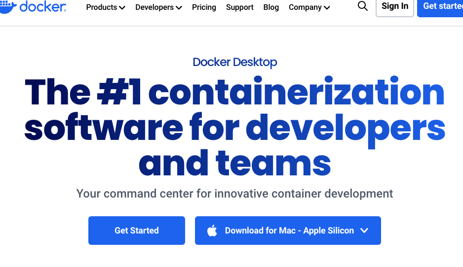
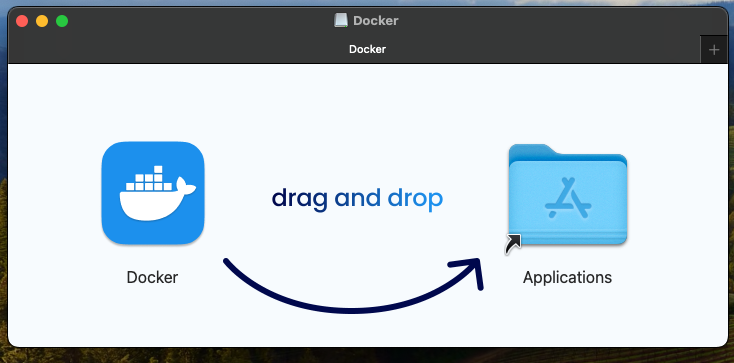
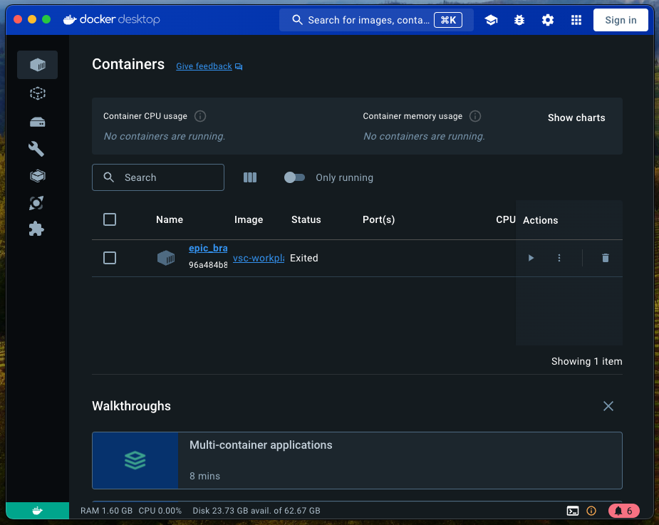

# Docker
## **Table of Contents**
1. [Introduction](#1-introduction)
2. [Prerequisites](#2-prerequisites)
3. [Install Docker](#3-install-docker)  
    3.1. [MacOS](#31-macos)  
    3.2. [Windows](#32-windows)  
4. [Appendix](#4-appendix)

## 1. **Introduction**

## 2. **Prerequisites**
In order to use this guide successfully, there may be assumptions within your current environment. Please follow these other guides that are dependencies to successfully utilizes this one. 

Local development environment:  
- [MacOS local developer environment](./../../mac/README.md)
- [Windows local developer environment](./../../windows/README.md)

## 3. **Install Docker**
### 3.1 MacOS
In this section, we will install Docker on the local machine. 

1. [Download](https://www.docker.com/products/docker-desktop/) Mac Docker Desktop

  

2. Run the installer

   

3. Open the Docker Desktop application. All the containers running will be shown in the dashboard.

   

### 3.2 Windows

## 4. **Appendix**
- [MacOS local developer environment](./../../mac/README.md)
- [Windows local developer environment](./../../windows/README.md)
