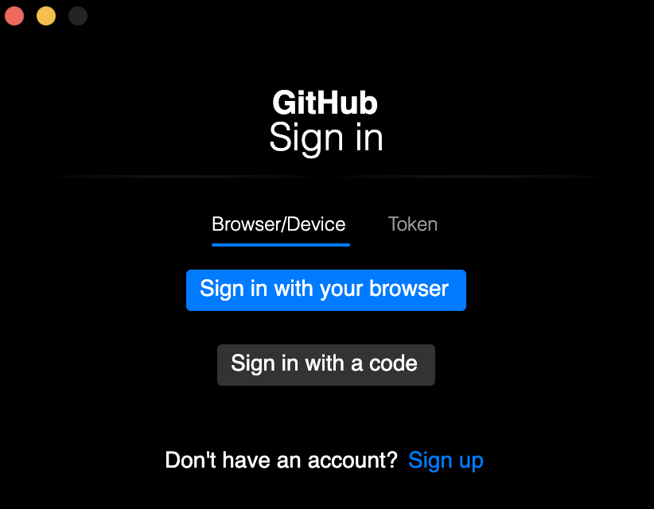
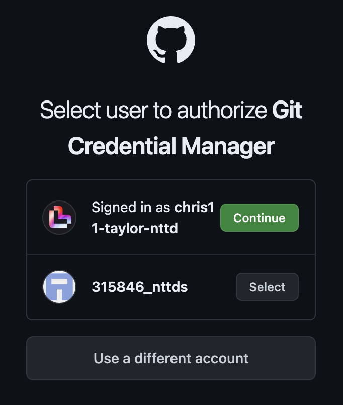
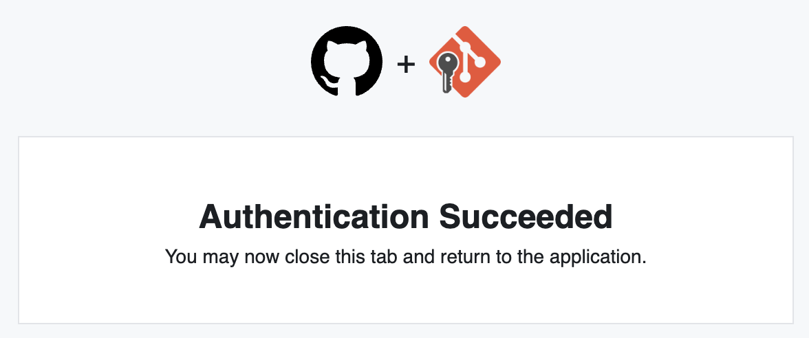
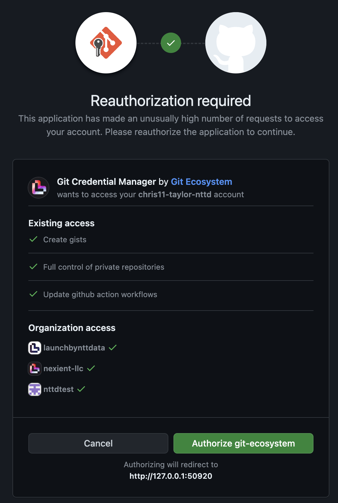

# Git Setup for Multiple Orgs/Identities

This document covers setting up to Git to interact with repositories from multiple organizations over HTTPS only. This is also possible to do with SSH keys, but that approach is out of scope for this document.

This document is intended for engineers at Launch to enable finer-grained control over Git identities when interacting with the two organizations that Launch uses, but is broadly applicable to segmenting identities on a per-client basis as well.

## Credential Management

We recommend using [git-credential-manager](https://github.com/git-ecosystem/git-credential-manager) to handle storing secrets on your local machine. This works out of the box with the OSX Keychain as well as the Windows Credential Store, though [Linux requires a bit of extra configuration](https://github.com/git-ecosystem/git-credential-manager/blob/release/docs/install.md#linux). [Install git-credential-manager](../git-credential-manager/README.md) using your system's preferred installation method. On an OSX machine, this was done with the following command:

```sh
brew install --cask git-credential-manager
```

Installing git-credential-manager should automatically populate this item in the .gitconfig file in your home directory, confirm its presence before proceeding:

```sh
# You should see this in your ~/.gitconfig file
[credential "https://dev.azure.com"]
        useHttpPath = true
```

Next, we'll allow GCM to store credentials on a per-repo basis, so we need to enable [useHttpPath](https://git-scm.com/docs/gitcredentials#Documentation/gitcredentials.txt-useHttpPath). This is what enables us to use different identities for different organizations in GitHub. You will need to issue the following command:

```sh
git config --global --add credential.https://github.com.useHttpPath true

```

Optionally, if you use other hostnames outside of `github.com` (perhaps you use Bitbucket or GitLab for a client), you'll want to substitute them in and run the command one time for each host you intend to use:

```sh
git config --global --add credential.https://bitbucket.org.useHttpPath true
git config --global --add credential.https://subdomain.example.net.useHttpPath true
```

The first time you interact with a new repository in a way that requires credentials, git-credential-manager will pop up a dialog box asking you how you want to authenticate:



I choose "Sign in with your browser" which redirects you to GitHub's authentication flow. In the event that you have multiple GitHub users, you may see a dialog like the following. If you haven't already authorized the Github Credential Manager app, do so now, then select the user you wish to use for this repository.



Once you choose a user, you should be shown the success screen, at which point you can interact with the cloned repo using the `git` commands as usual.



If this repository is publicly-accessible, you may not need to go through the login flow when you clone the repository, the dialog and login process may only happen after you attempt to `git push` back to the repo. If the repository is private or internal, you'll be asked to authenticate at clone time and any `git push` operations should use the credentials established when the repository was cloned.

I have noticed that when I try to authorize multiple accounts in a short timespan, occasionally I am presented a dialog to reauthorize the GitHub app. Click the "Authorize" button at the bottom to proceed past this dialog.



## Folder structure

I keep all my Git repositories underneath a single top-level folder and split along organization lines, which has worked well. The `Per-folder Git Config` section that follows assumes you have split your local storage in a similar fashion.

```
# Top-level folder under which everything Git-related is contained
/home/chris.taylor/code

# My folders are named to match their GitHub Organization name, but can be anything memorable for you.
/home/chris.taylor/code/chris11-taylor-nttd
/home/chris.taylor/code/launchbynttdata
/home/chris.taylor/code/nttdata-launch
/home/chris.taylor/code/client-a
/home/chris.taylor/code/client-b
/home/chris.taylor/code/client-c
```

## Per-folder Git Config

By default, Git creates a `.gitconfig` file in your home directory to store your settings. A common problem that we run into is that our default `user.name` and `user.email` values won't match what a given client expects.

When I'm interacting with our Launch repositories, I want to use the following identity:

```
name = Chris Taylor
email = chris11.taylor@nttdata.com
```

However, when interacting with `client A`, they require that I provide:

```
name = Chris Taylor
email = ctaylor@client-a.org
```

To accommodate this, we will create a `.gitconfig` file for each of the organizations/subfolders above so that we can have separate configurations for each. A few examples are shown below:

```sh
# ~/.gitconfig.launchbynttdata
[user]
    name = Chris Taylor
    email = chris11.taylor@nttdata.com
```

```sh

# ~/.gitconfig.client-a
[user]
    name = Chris Taylor
    email = ctaylor@client-a.org
```

Finally, to make Git utilize these configuration files, we need to add some [conditional includes](https://git-scm.com/docs/git-config#_conditional_includes) to the main `.gitconfig` file.

```sh
# ~/.gitconfig
[includeIf "gitdir:~/code/chris11-taylor-nttd"]
	path = ~/.gitconfig.chris11-taylor-nttd
[includeIf "gitdir:~/code/launchbynttdata"]
	path = ~/.gitconfig.launchbynttdata
[includeIf "gitdir:~/code/nttdata-launch"]
	path = ~/.gitconfig.nttdata-launch
[includeIf "gitdir:~/code/client-a"]
	path = ~/.gitconfig.client-a
...
```

Now, any configuration item for Git can be applied to any organizational folder just by editing a single .gitconfig for that organization. This, combined with git-credential-manager prompting you to authenticate for each new repository URL you encounter, allows you the flexibility to authenticate and appear as whichever user is necessary for a given project.

As you encounter new organizations, you'll need to maintain the folder structure and config files.

## Troubleshooting

If you're not able to get the above to work, you may need to reset git's path to the git-credential-manager tool:

```sh
git config --global --add credential.https://github.com.helper $(which git-credential-manager)
```

If you're not being prompted to authenticate with your repository upon push, or you find that git is consistently authenticating you with a user you don't expect and you're on OSX, you may need to clear the keychain entry. Open Keychain Access, select your `login` keychain, search for `github` and remove all matching entries. Confirm usehttppath is set for the host you're expecting in your .gitconfig and try again.

If you're not seeing any records created in your Keychain and the GCM tool doesn't appear to work, double-check to make sure you haven't provided credentials through your .netrc file!