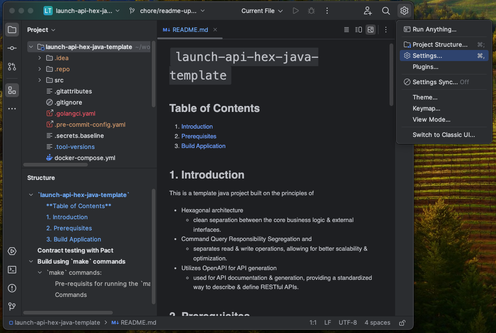
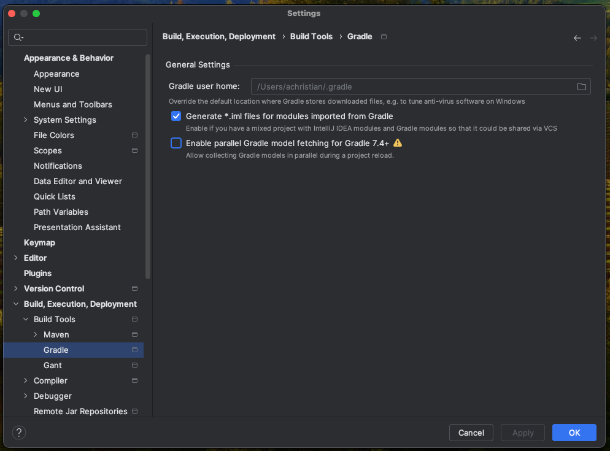

# Gradle
## **Table of Contents**
1. [Introduction](#1-introduction)
2. [Prerequisites](#2-prerequisites)
3. [Install Gradle](#3-install-gradle)  
    3.1. [IntelliJ](#31-intelliJ)  
    3.2. [Visual Studio Code](#32-visual-studio-code)  
    3.3. [MacOS local](#33-macos-local)  
    3.4. [Windows local](#34-windows-local) 
4. [Appendix](#4-appendix)

## 1. **Introduction**

## 2. **Prerequisites**

## 3. **Install Gradle**

### 3.1 IntelliJ
- IntelliJ IDE has in built Gradle support. Click on the gear icon in the top right, `IDE and Project Settings` and click `Settings`

   

- Click on `Build, Execution, Deployment` -> `Build Tools` -> `Gradle`, then click on `Ok`

   

### 3.2 Visual Studio Code

### 3.3 MacOS local

### 3.4 Windows local

## 4. **Appendix**
Local development environment:  
- [MacOS local developer environment](./../../mac/README.md)
- [Windows local developer environment](./../../windows/README.md)