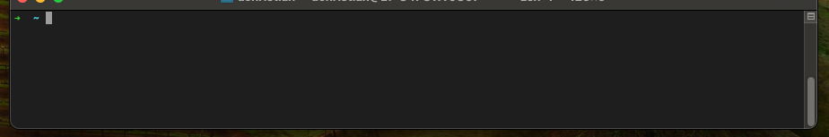
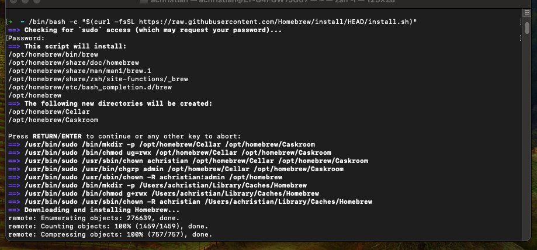
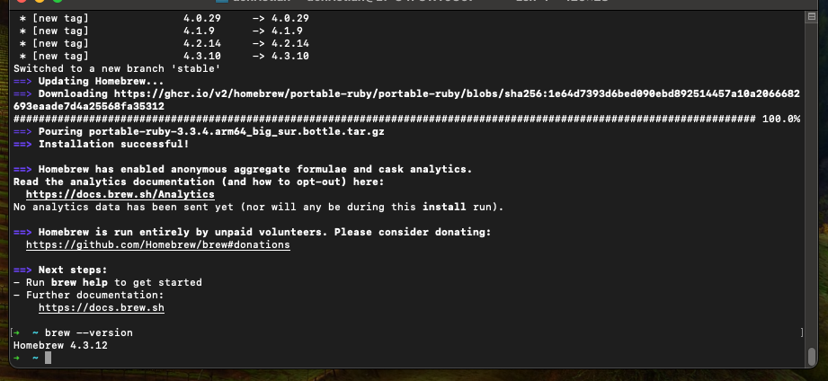

# Homebrew
## **Table of Contents**
1. [Introduction](#1-introduction)
2. [Prerequisites](#2-prerequisites)
3. [Install Homebrew](#3-install-homebrew)  
4. [Appendix](#4-appendix)

## 1. **Introduction**
This guide will walk you through installing Homebrew on your local MacOS device. Homebrew is used as a package manager for various tools and software needed.

## 2. **Prerequisites**
In order to use this guide successfully, there may be assumptions within your current environment. Please follow these other guides that are dependencies to successfully utilizes this one. 

Local development environment:  
- [MacOS local developer environment](./../../mac/README.md)
- [Windows local developer environment](./../../windows/README.md)

## 3. **Install Homebrew**
1. Open Terminal.

<p align="center">
   
</p>

2. Install Homebrew by running the following command:

    ```sh
    $ /bin/bash -c "$(curl -fsSL https://raw.githubusercontent.com/Homebrew/install/HEAD/install.sh)"
    ```

<p align="center">
   
</p>

3. Once the installation is complete, verify it by running:

    ```sh
    $ brew --version
    ```

<p align="center">
   
</p>

## 4. **Appendix**
- [MacOS local developer environment](./../../mac/README.md)
