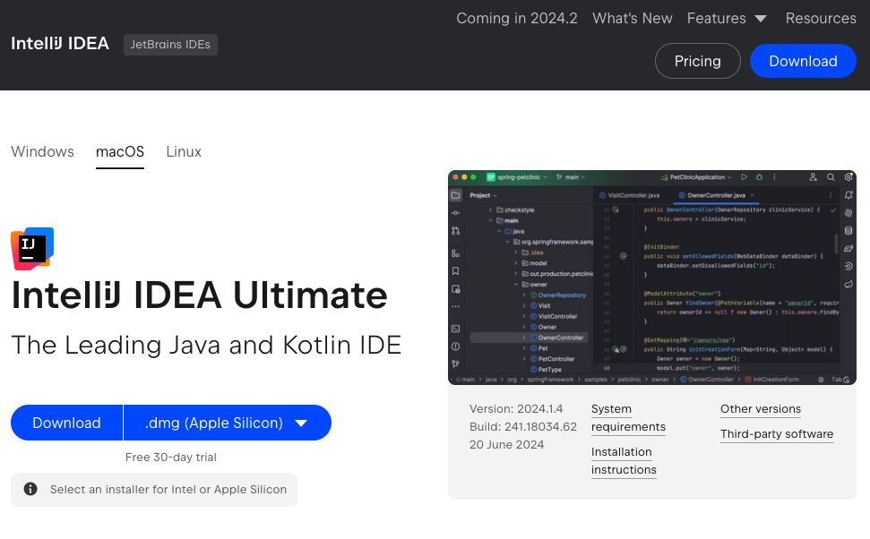
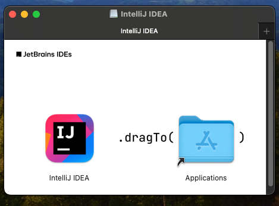
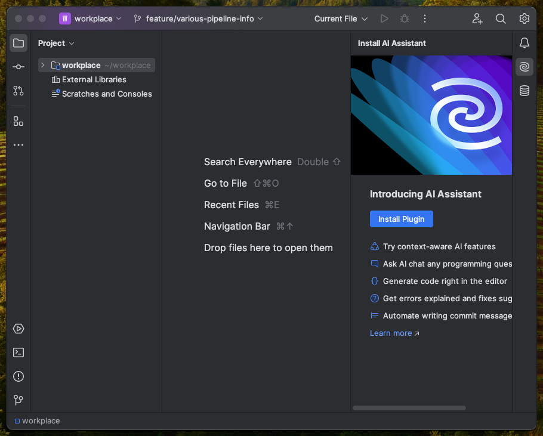
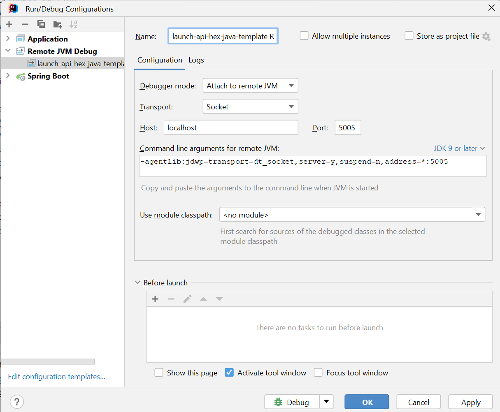

# IntelliJ IDEA
## **Table of Contents**
1. [Introduction](#1-introduction)
2. [Prerequisites](#2-prerequisites)
3. [Install IntelliJ IDEA](#3-install-intellij-idea)  
    3.1. [MacOS](#31-macos)  
    3.2. [Windows](#32-windows)  
4. [IntelliJ IDEA configuration](#4-intellij-idea-configuration)  
  4.1. [Developer Environment](#41-developer-environment)  
  4.2. [Remote Debug Mode](#42-remote-debug-mode)  
  4.3. [Builder Tools](#43-builder-tools)  
6. [Appendix](#5-appendix)

## 1. **Introduction**

## 2. **Prerequisites**

## 3. **Install IntelliJ IDEA**

### 3.1 MacOS
In this section, we will install IntelliJ on the local machine. 

1. [Download](https://www.jetbrains.com/idea/download/?section=mac) Intellij

  

2. Run the installer, specify path for installation

   

3. Open IntelliJ IDE and select a project to open

    - If you need to activate your license, please follow these [official guides](https://www.jetbrains.com/help/idea/register.html#start_trial).

   

### 3.2 Windows

## 4. **IntelliJ IDEA configuration**

### 4.1. Developer Environment
Use a Dev Container
- [IntelliJ Dev Containersl](./dev-containers/README.md)

### 4.2 Remote Debug Mode
Use the following steps to set up remote debugging when you want to debug an application started in a docker container or using `gradlew bootRun` command:

#### 1. Open the Run/Debug Configurations

1. Open IntelliJ IDEA.
2. Navigate to the top menu and select **Run** > **Edit Configurations...**.
3. In the **Run/Debug Configurations** dialog, click on the **+** button in the upper-left corner to add a new configuration.
4. From the dropdown list, choose **Remote JVM Debug**.

#### 2. Configure Remote Debugging

1. In the **Name** field, enter a descriptive name for your configuration, such as `launch-api-hex-java-template`.
2. Under the **Settings** section:
    - Set **Host** to `localhost` (or the remote server's IP address if applicable).
    - Set **Port** to `5005`.
    - Ensure that **Debugger mode** is set to `Attach` (this is typically the default).

  

   

### 4.3. Builder Tools

## 5. **Appendix**
Local development environment:  
- [MacOS local developer environment](./../../mac/README.md)
- [Windows local developer environment](./../../windows/README.md)