# IntelliJ Dev Containers
## **Table of Contents**
1. [Introduction](#1-introduction)
2. [Prerequisites](#2-Prerequisites)
3. [Step-by-step Guide](#3-step-by-step-guide)
4. [Reference](#4-reference)

## 1. Introduction
This guide will walk you through setting up a development container environment using IntelliJ Dev Containers. By using dev containers, you can ensure a consistent and reproducible development environment for your code.

## 2. Prerequisites
In order to use this guide successfully, there may be assumptions within your current environment. Please follow these other guides that are dependencies to successfully utilizes this one. 

Local development environment:
- [MacOS local developer environment](./../../../../../development-environments/local/mac/README.md)
- [Windows local developer environment](./../../../../../development-environments/local/java/windows/README.md)
- [IntelliJ Install](./../README.md)

## 3. Step-by-step Guide

Open an IntelliJ IDE project 

  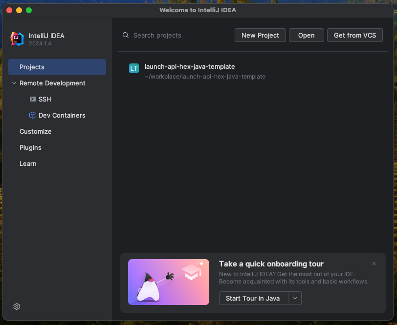 

Click on the gear icon in the top right, `IDE and Project Settings` and click `Settings`

  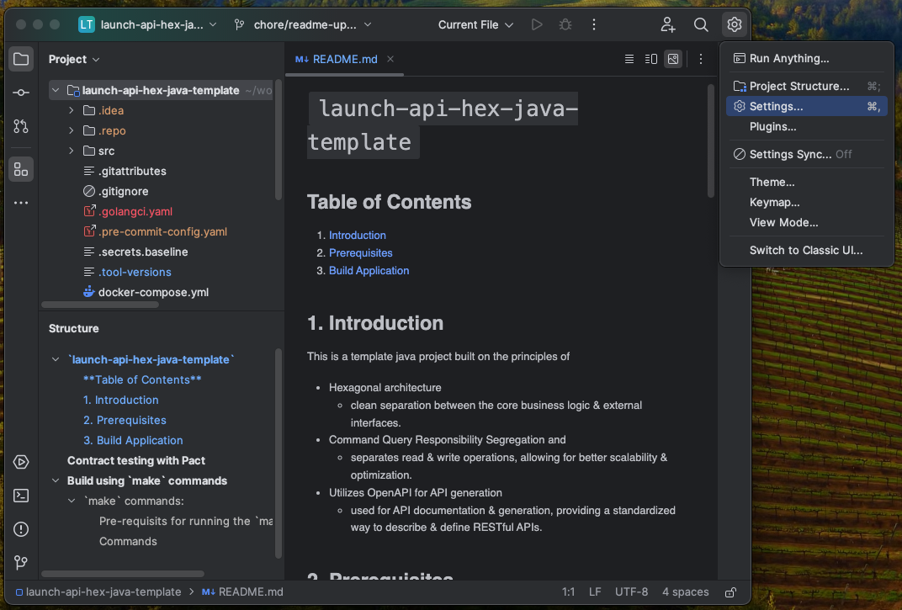 

Click on `Plugins` and search for `containers`. Ensure `Dev Containers` is enabled and click `Ok`.

  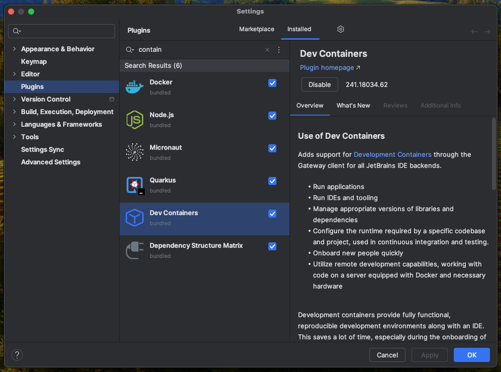 

Add a 2 new files to the root of the repo's repository called `.devcontainer.json` and `.devcontainer.postCreate.sh`.

  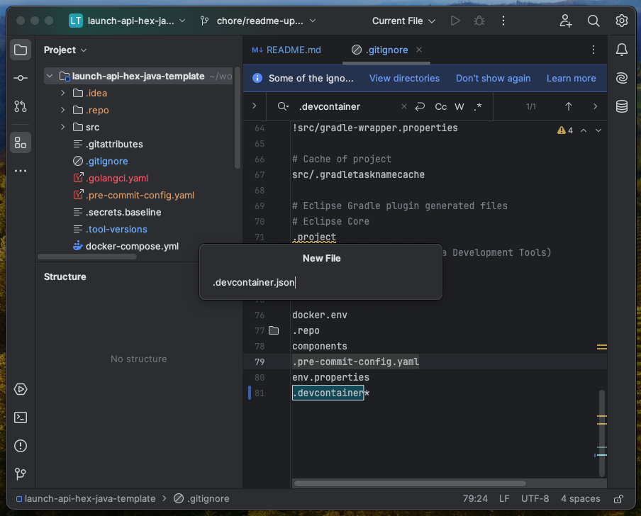  
  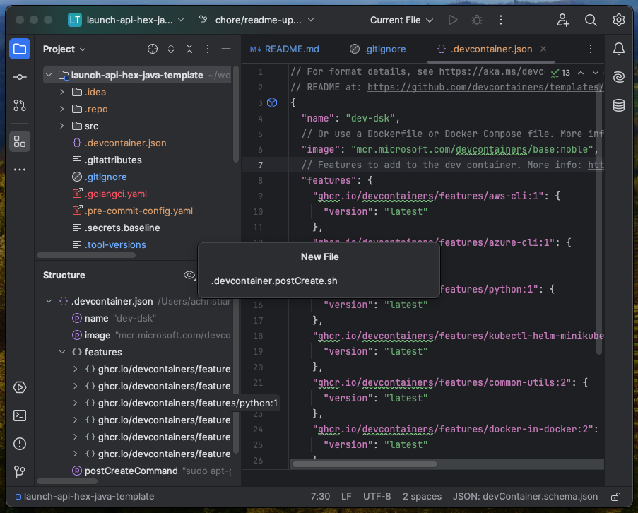

We are now going to update the `.devcontainer.json` with our template from this guide. 

You can find the file at:
- [.devcontainer.json](./files/.devcontainer.json)

Copy the settings from that into your newly created `.devcontainer.json` file.

  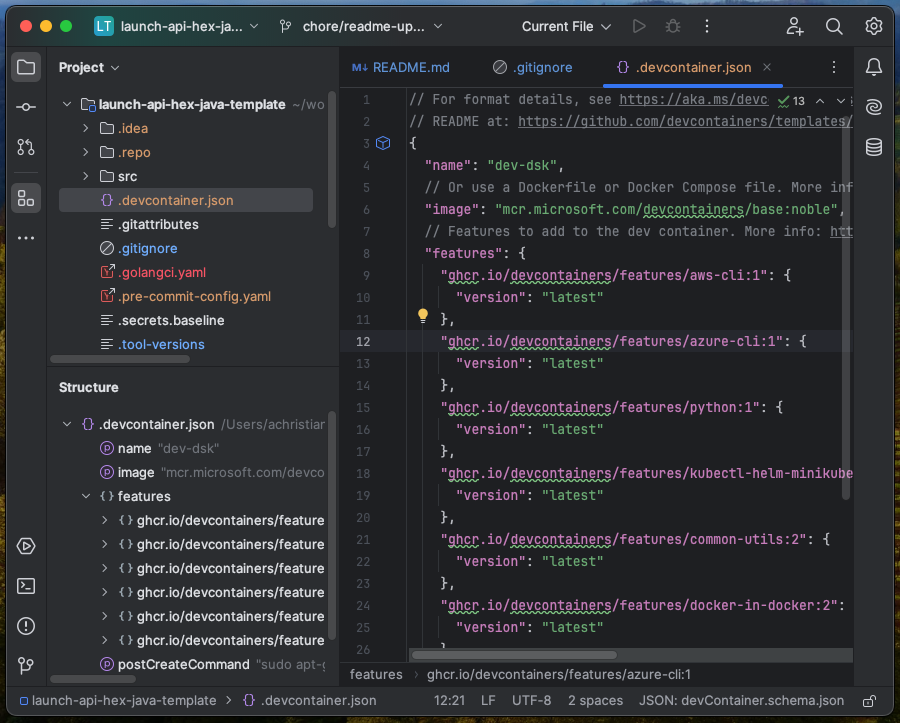 

Within `.devcontainer.json`, update the path in the `postCreateCommand` to the path to where you saved `.devcontainer.postCreate.sh`. 
`/workspaces/workplace/myproject/.devcontainer.postCreate.sh`

  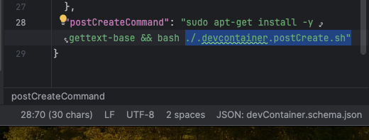 

We are now going to update the `.devcontainer.postCreate.sh` with our template from this guide.

You can find the file at:
- [.devcontainer.postCreate.sh](./files/.devcontainer.postCreate.sh)

  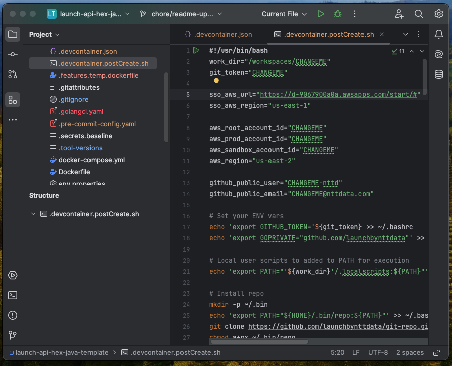 

Within the `.devcontainer.postCreate.sh`, update the vars at the top of the file with your config.

  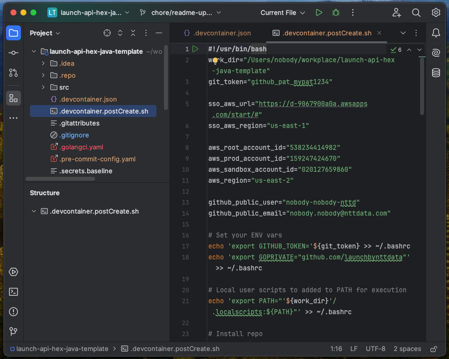 

Once files are updated and saved, right click on the `.devcontainer.json` file:
- Go to `Dev Containers` -> `Create Dev Container and Mount Sources`

  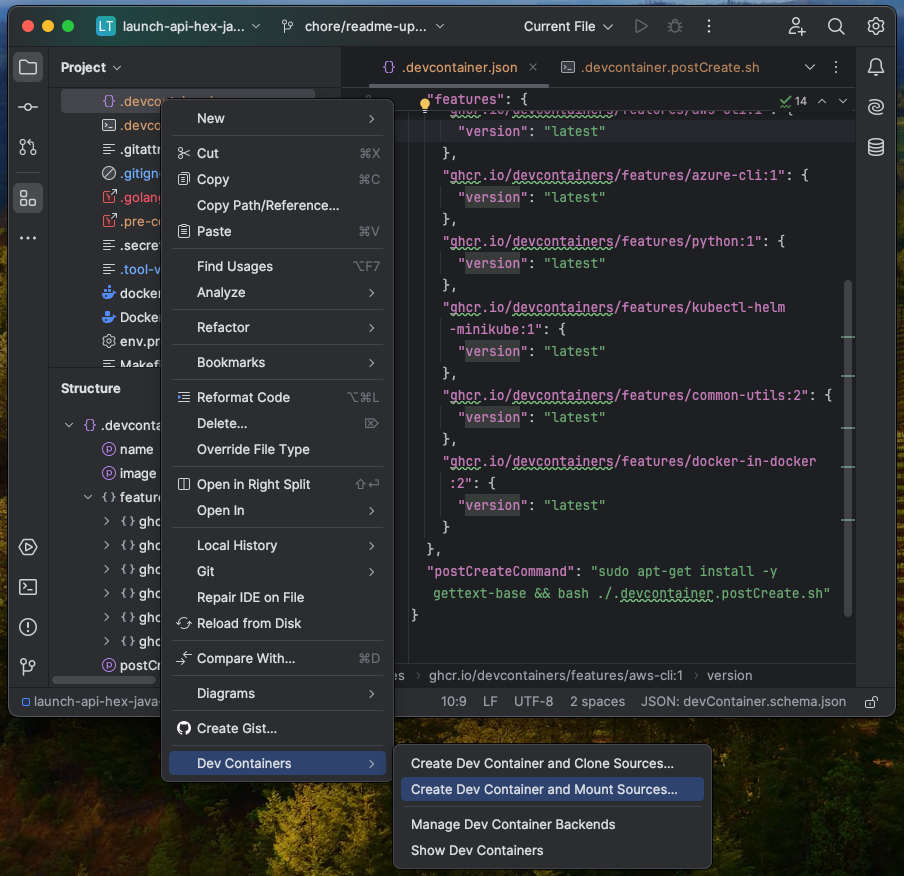 

The container will now build. 

  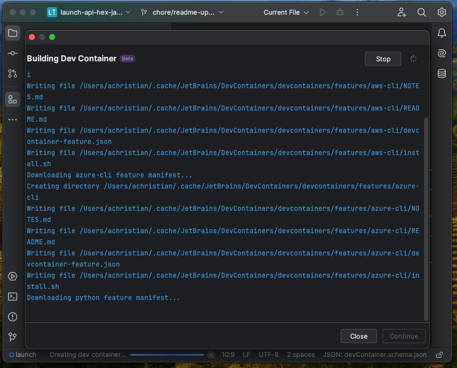

Once the container has built, hit `Continue`

  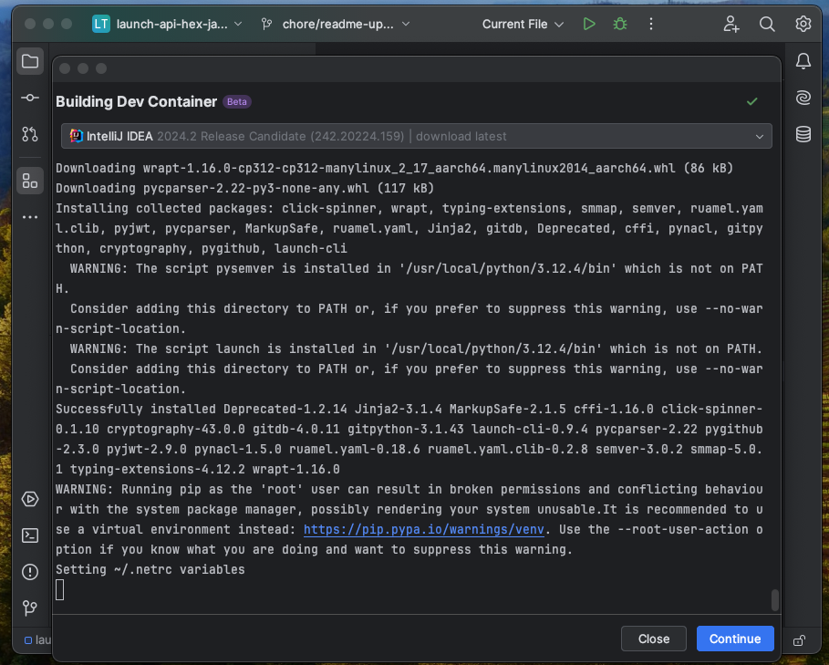

Your client may go into a download loop for additional packages. Keep hitting `Continue` until fully built. 

  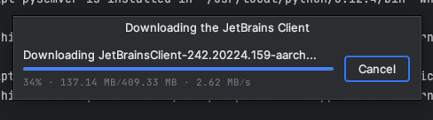

After building, a new window will launch with your dev container.

  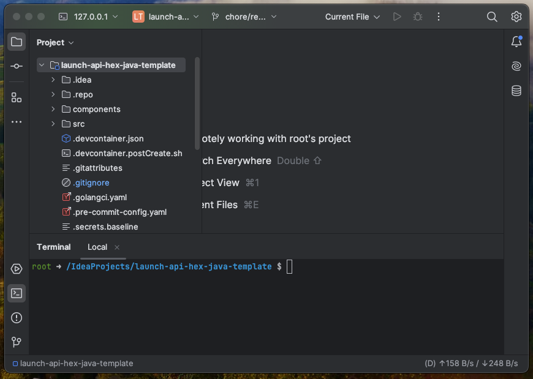

## 4. Reference
- [IntelliJ Dev Containers](https://www.jetbrains.com/help/idea/connect-to-devcontainer.html)
