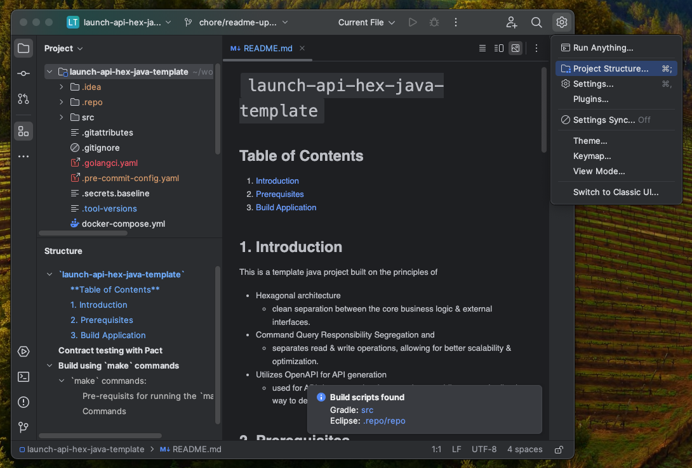
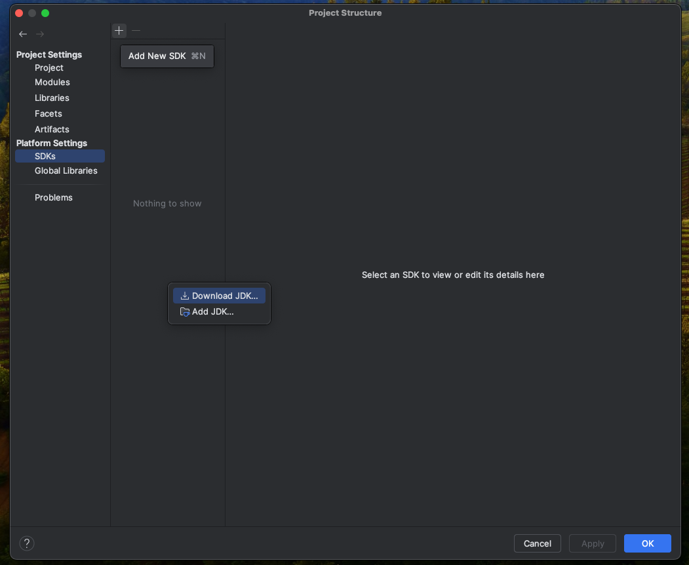
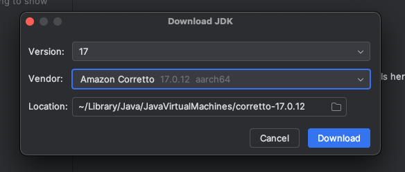
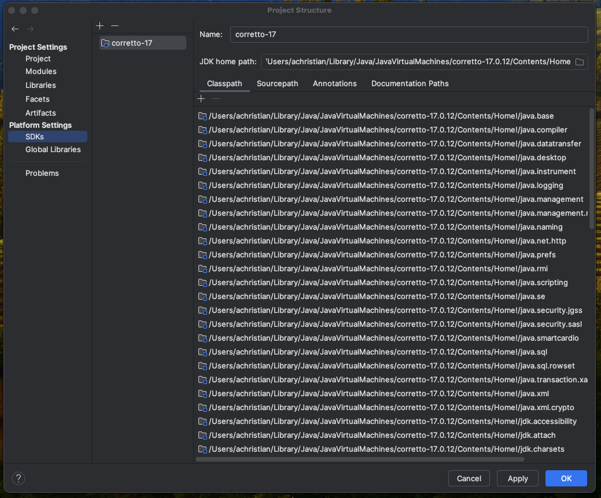
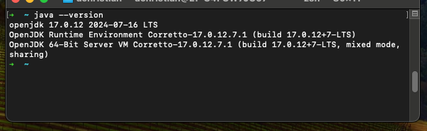

# Java JDK 17
## **Table of Contents**
1. [Introduction](#1-introduction)
2. [Prerequisites](#2-prerequisites)
3. [Install Java](#3-install-java)  
4. [Appendix](#4-appendix)

## 1. **Introduction**

## 2. **Prerequisites**

## 3. **Install Java**

- Open a project in Intellij IDE
<p align="center">
   
</p>
- Click on the gear icon in the top right, `IDE and Project Settings` and click `Project Structure`

<p align="center">
   
</p>

- A New window will pop up. Click `SDKs` in the left menu. Then Click the `+` sign and then `Download JDK`

<p align="center">
   
</p>

- Select version `17`, then `Amazon Corretto 17`. Click `Download`.

<p align="center">
   
</p>

- After downloaded, click `Ok`
<p align="center">
   
</p>

- Launch a terminal and type the following to ensure java was installed.
```sh
$ java --version
```
<p align="center">
   
</p>
- Run the command in terminal to set JAVA_HOME "export JAVA_HOME=/Library/Java/JavaVirtualMachines/amazon-corretto-17.jdk/Contents/Home"
- Add the jdk/bin path to system path variable PATH=$JAVA_HOME/bin:$PATH

- Run the following commands to set you `JAVA_HOME` and `PATH`
```sh
$ echo 'export JAVA_HOME="/Library/Java/JavaVirtualMachines/amazon-corretto-17.jdk/Contents/Home"' >> ~/.zshrc
$ echo 'export PATH="$JAVA_HOME/bin:$PATH"' >> ~/.zshrc
$ source ~/.zshrc
```

## 4. **Appendix**
Local development environment:  
- [MacOS local developer environment](./../../../mac/README.md)
- [Windows local developer environment](./../../../windows/README.md)