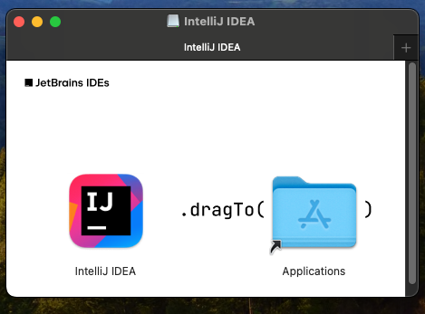

# Jetbrains IDEs
## **Table of Contents**
1. [Introduction](#1-introduction)
2. [Prerequisites](#2-prerequisites)
3. [Install IntelliJ IDEA](#3-install-intellij-idea)  
    3.1. [MacOS](#31-macos)  
    3.2. [Windows](#32-windows)  
4. [Configuration](#4-configuration)  
  4.1. [Developer Environment](#41-developer-environment)  
5. [Appendix](#5-appendix)

## 1. **Introduction**
This guide will walk you through installing and configuring IntelliJ IDEA within your local environment. In addition, there is the ability to configure and run a developer container within the IDE. 

## 2. **Prerequisites**
In order to use this guide successfully, there may be assumptions within your current environment. Please follow these other guides that are dependencies to successfully utilizes this one. 

Local development environment:  
- [MacOS local developer environment](./../../mac/README.md)
- [Windows local developer environment](./../../windows/README.md)

## 3. **Install IntelliJ IDEA**

### 3.1 MacOS
In this section, we will install IntelliJ on the local machine. 

1. [Download](https://www.jetbrains.com/idea/download/?section=mac) Intellij

  

2. Run the installer, specify path for installation

   

3. Open IntelliJ IDE and select a project to open

    - If you need to activate your license, please follow these [official guides](https://www.jetbrains.com/help/idea/register.html#start_trial).

   

### 3.2 Windows
TODO:

## 4. **Configuration**
### 4.1. Developer Environment
Use a Dev Container
- [IntelliJ Dev Container](./dev-containers/README.md)

## 5. **Appendix**
- [MacOS local developer environment](./../../mac/README.md)
- [Windows local developer environment](./../../windows/README.md)
