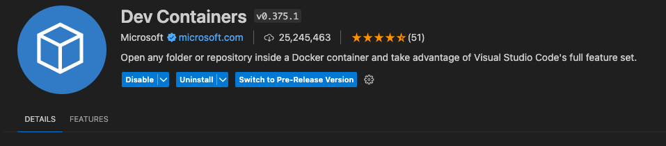

# Visual Studio Code Dev Containers

This guide will walk you through setting up a development conteinaer environment using Visual Studio Code (VS Code) Dev Containers. By using dev containers, you can ensure a consistent and reproducible development environment for your code.


## Prerequistes
- [Local environment setup- Mac](#)
  - or [Local environment setup- Windows](#)
- [VS Code is installed](#)

## Step-by-step Guide

### Install Remote-Containers VS Code Extension
Please follow this guide on how to install an extension in VS Code:
- [https://code.visualstudio.com/docs/editor/extension-marketplace](https://code.visualstudio.com/docs/editor/extension-marketplace)

Please install the Dev Containers extension from the extension marketplace:
- [https://marketplace.visualstudio.com/items?itemName=ms-vscode-remote.remote-containers](https://marketplace.visualstudio.com/items?itemName=ms-vscode-remote.remote-containers)

<p align="center">
   
</p>


### Configure your folder
Somewhere within your OS, please create or identify a folder in which you wish to be the root of your dev container's home directory. Within this example, we have created a new folder called `workplace` within the home directory of the user. 

```
/Users/MyUser/workplace
```

### Configure `devcontainer.json`
- [devcontainer.json](./files/devcontainer.json)

### Configure Post Create script
- [dev.postCreate.sh](./files/dev.postCreate.sh)


### Build and open the container


### Final thoughts


## References
- [Developing inside a Container](https://code.visualstudio.com/docs/devcontainers/containers)
- [Create a Dev Container](https://code.visualstudio.com/docs/devcontainers/create-dev-container)