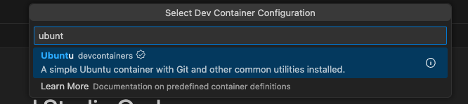
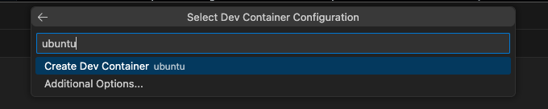
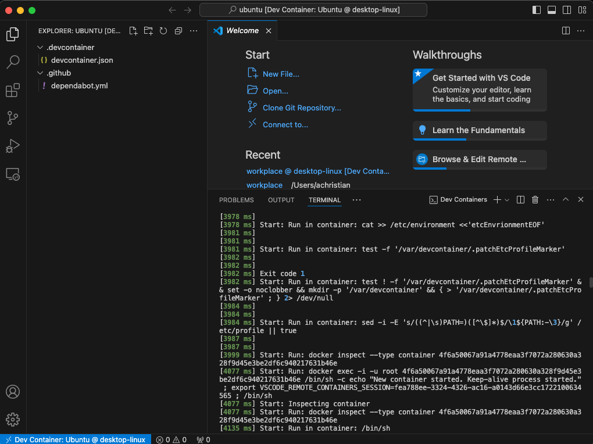
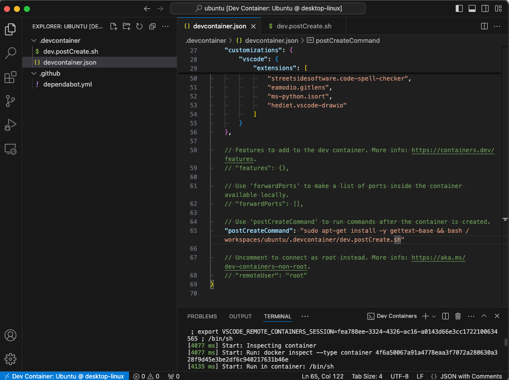
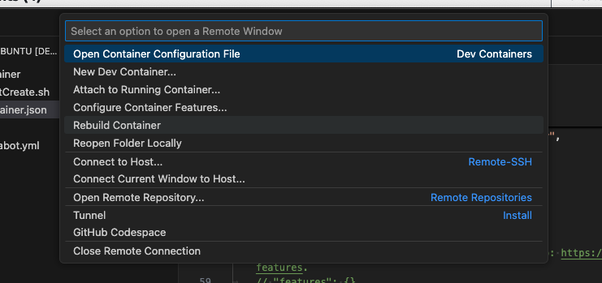
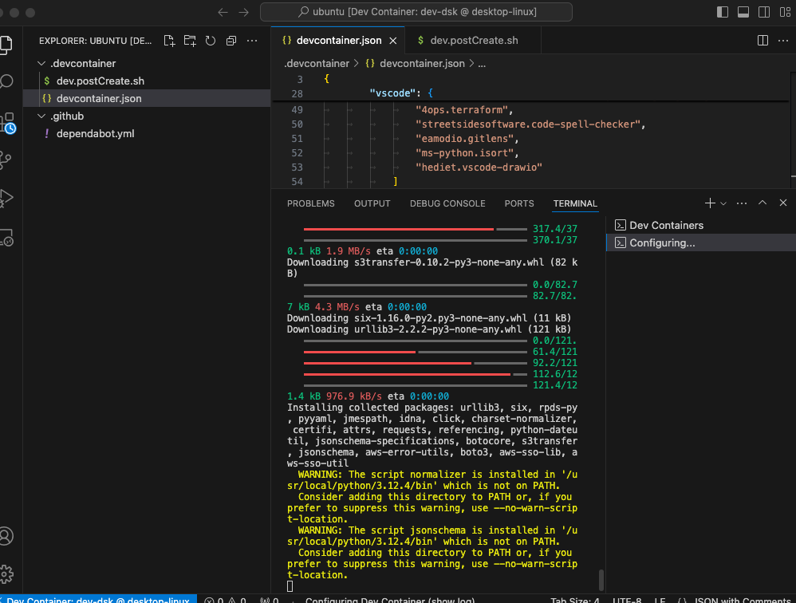

# Visual Studio Code Dev Containers

This guide will walk you through setting up a development container environment using Visual Studio Code (VS Code) Dev Containers. By using dev containers, you can ensure a consistent and reproducible development environment for your code.

## Prerequistes
- Local environment setup
  - [Mac](./../../java/mac/README.md)
  - [Windows](./../../java/windows/README.md)
- [VS Code is installed](./../README.md)

## Step-by-step Guide

### Install Remote-Containers VS Code Extension
Please follow this guide on how to install an extension in VS Code:
- [https://code.visualstudio.com/docs/editor/extension-marketplace](https://code.visualstudio.com/docs/editor/extension-marketplace)

Please install the `Dev Containers` extension from the extension marketplace:
- [https://marketplace.visualstudio.com/items?itemName=ms-vscode-remote.remote-containers](https://marketplace.visualstudio.com/items?itemName=ms-vscode-remote.remote-containers)

<p align="center">
   
</p>

### Configure your folder
Somewhere within your base operating system, please create or identify a folder in which you wish to be the root of your dev container's home directory. Within this example, we have created a new folder called `workplace` within the home directory of the user. When you run a dev container, you have the ability to attach it to your current workspace. This path is going to be needed in some of the scripts we are going to be updating.

```
/Users/MyUser/workplace
```

### Create a new Dev Container
In your vscode search bar, search for `Dev Containers: New Container` and click on it.
<p align="center">
   
</p>

A mini-wizard will pop up. Search for `Ubuntu` and click on it.

<p align="center">
   
</p>

Click `Create Dev Container`

<p align="center">
   
</p>

This will create and build a new Ubuntu dev container. 

<p align="center">
   
</p>

### Configure Container
We are now going to update the `devcontainer.json` with our template from this guide. You can find the file at:

- [devcontainer.json](./files/devcontainer.json)

There is also another file within this guide called `dev.postCreate.sh`. This script is a first time boot script that runs after your container is built. This script performs most of our containers configuration. 
- [dev.postCreate.sh](./files/dev.postCreate.sh)

Within `devcontainer.json`, update the path in the `postCreateCommand` to the path to where you saved `dev.postCreate.sh`. 
`/workspaces/workplace/.vscode/dev.postCreate.sh"`
It is a good idea to save it in the workspace dir. In this guide, we will place it in a `.vscode` folder within the workspace directory.

<p align="center">
   
</p>

Within the `dev.postCreate.sh`, update the vars at the top of the file with your config.

<p align="center">
   
</p>


### Build and open the container
Rebuild the container `>Dev Container: Rebuild Container`

<p align="center">
   
</p>

<p align="center">
   
</p>

<p align="center">
   
</p>

## References
- [Developing inside a Container](https://code.visualstudio.com/docs/devcontainers/containers)
- [Create a Dev Container](https://code.visualstudio.com/docs/devcontainers/create-dev-container)