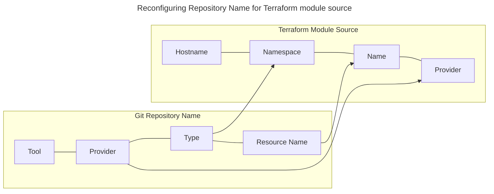

# Terraform Module Registry

Launch provides a publicly-accessible Terraform Module Registry that can be used to retrieve our modules.

To utilize this registry, you must craft a module source in your Terraform code that points at our registry and the module you wish to consume.

This snippet demonstrates a registry source for an example module:

```hcl
module "resource_name" {
    source = "terraform.registry.launch.nttdata.com/module_library/resource_name/launch"
    version = "~> 1.0"

    ...
}
```

## Module Source Construction

Constructing a module source value requires four pieces of information:

- Hostname 
- Namespace
- Name
- Provider

The **hostname** for our registry is always `terraform.registry.launch.nttdata.com`. Do not specify the protocol; Terraform will force this to be HTTPS.

The **namespace**, **name**, and **provider** values are driven based on the name of the repository in question. Refer to our [IaC Git Repository Naming Scheme](../../../standards/common-development/git/repository/naming-schemes/iac-repository-names.md) for a refresher on how our names are constructed. 

```
Repository name inputs for example Azure Key Vault:

Tool: tf (Terraform)
Provider: azurerm (Microsoft Azure Cloud)
Type: module_primitive
resource: key_vault

Repository name output:

    tf-azurerm-module_primitive-key_vault

Registry name inputs for the same repo:

Hostname: terraform.registry.launch.nttdata.com (never changes)
Namespace: module_primitive
Name: key_vault
Provider: azurerm

Registry source output:

terraform.registry.launch.nttdata.com/module_primitive/key_vault/azurerm

```

A graphical representation of this mapping can be found here:



For the official documentation from HashiCorp around registry sources, [see here](https://developer.hashicorp.com/terraform/language/modules/sources#terraform-registry).

## Fuzzy Versioning

By utilizing the `source` and `version` when creating your Terraform modules, you gain the ability to supply fuzzy version matches. 

While any version string that Terraform supports is valid, we encourage the use of the [Pessimistic Constraint Operator](https://developer.hashicorp.com/terraform/language/expressions/version-constraints#-3) (`~>`) as it can be used to set a compatible floor version and consume from all non-breaking releases past that point, a natural fit with our semantic versioning strategy.

Setting your version to `~> 1.0` would mean that version 1.0.0, 1.0.1, and 1.999.0 are all valid, but 2.0.0 would not be valid.

## Limitations

Our Terraform Module registry will only serve modules that exist within our GitHub organization located at https://github.com/launchbynttdata. 

Only modules that are set as publicly-accessible can be served through this registry.
